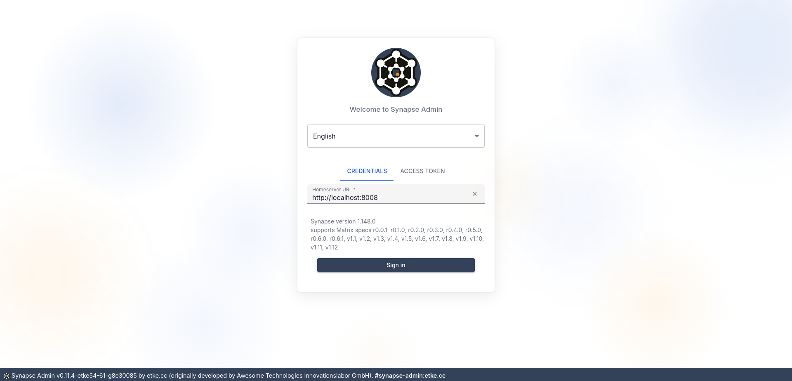

<p align="center">
  
  <h3 align="center">
    Synapse Admin<br>
    <a href="https://matrix.to/#/#synapse-admin:etke.cc">
      
    </a><br>
    <a href="./LICENSE">
      
    </a>
    <a href="https://api.reuse.software/info/github.com/etkecc/synapse-admin">
      
    </a>
  </h3>
  <p align="center">Feature-packed and visually customizable: A better way to manage your Synapse homeserver.</p>
</p>

---




[View all screenshots](./screenshots/README.md)

<!-- vim-markdown-toc GFM -->

* [Fork differences](#fork-differences)
  * [Availability](#availability)
    * [Prebuilt distributions](#prebuilt-distributions)
    * [IPFS](#ipfs)
  * [Changes](#changes)
    * [exclusive for etke.cc customers](#exclusive-for-etkecc-customers)
  * [Development](#development)
  * [Support](#support)
* [Configuration](#configuration)
  * [Prefilling login form](#prefilling-login-form)
  * [Restricting available homeserver](#restricting-available-homeserver)
  * [Configuring CORS credentials](#configuring-cors-credentials)
  * [Protecting appservice managed users](#protecting-appservice-managed-users)
  * [Adding custom menu items](#adding-custom-menu-items)
  * [Enabling external auth provider-compatible mode](#enabling-external-auth-provider-compatible-mode)
    * [Matrix Authentication Service (MAS) specifics](#matrix-authentication-service-mas-specifics)
* [Usage](#usage)
  * [Supported APIs](#supported-apis)
  * [Supported Synapse](#supported-synapse)
  * [Prerequisites](#prerequisites)
  * [Use without install](#use-without-install)
  * [Step-by-step installation](#step-by-step-installation)
    * [Steps for 1)](#steps-for-1)
    * [Steps for 2)](#steps-for-2)
    * [Steps for 3)](#steps-for-3)
  * [Serving Synapse Admin on a different path](#serving-synapse-admin-on-a-different-path)
* [Development](#development-1)

<!-- vim-markdown-toc -->

## Fork differences

With [Awesome-Technologies/synapse-admin](https://github.com/Awesome-Technologies/synapse-admin) as the upstream,
this fork introduces numerous enhancements to improve usability and extend functionality,
including support for authenticated media, advanced user management options, and visual customization.
The full list is described below in the [Changes](#changes) section.

### Availability

* As a core/default component on [etke.cc](https://etke.cc/?utm_source=github&utm_medium=readme&utm_campaign=synapse-admin)
* As a standalone app on [admin.etke.cc](https://admin.etke.cc)
* As a prebuilt distribution on [GitHub Releases](https://github.com/etkecc/synapse-admin/releases) for root-path (e.g., `https://admin.example.com`, `synapse-admin.tar.gz`) and `admin` subpath (e.g., `https://example.com/admin`, `synapse-admin-subpath-admin.tar.gz`) deployment
* As a prebuilt snapshot of the latest development version from [GitHub Actions](https://github.com/etkecc/synapse-admin/actions/workflows/workflow.yml) (click on the latest successful workflow run, then scroll down to the "Artifacts" section and download either `dist-root` or `dist-subpath-admin` artifact depending on your desired deployment path)
* As a Docker container on [Docker Hub](https://hub.docker.com/r/etkecc/synapse-admin) and [GitHub Container Registry](https://github.com/etkecc/synapse-admin/pkgs/container/synapse-admin)
* As a component in [Matrix-Docker-Ansible-Deploy Playbook](https://github.com/spantaleev/matrix-docker-ansible-deploy/blob/master/docs/configuring-playbook-synapse-admin.md)
* As a [Nix package](https://search.nixos.org/packages?show=synapse-admin-etkecc) maintained by [@Defelo](https://github.com/Defelo)
* As a [Arch Linux AUR package](https://aur.archlinux.org/packages/synapse-admin-etke-git) maintained by [@drygdryg](https://github.com/drygdryg)

#### Prebuilt distributions

We offer two prebuilt distributions for different deployment paths:
* (default) for root path (e.g., `https://admin.example.com`) as `synapse-admin.tar.gz`
* for `admin` subpath (e.g., `https://example.com/admin`) as `synapse-admin-subpath-admin.tar.gz`

You can find the latest **released** versions on the [GitHub Releases](https://github.com/etkecc/synapse-admin/releases) - download the appropriate `.tar.gz` file and follow the instructions in the [step-by-step installation](#step-by-step-installation) section.

You can find the latest **development (nightly)** versions in the [GitHub Actions](https://github.com/etkecc/synapse-admin/actions/workflows/workflow.yml) - click on the latest successful workflow run, then scroll down to the "Artifacts" section and download either `dist-root` or `dist-subpath-admin` artifact depending on your desired deployment path. After that, follow the instructions in the [step-by-step installation](#step-by-step-installation) section.

#### IPFS

> Maintained by [Fеnикs (@fenuks:sibnsk.net)](https://matrix.to/#/@fenuks:sibnsk.net)

**Latest version**

`/ipns/synapse-admin.sibnsk.net` (dnslink key `/ipns/k51qzi5uqu5dj91scsxoqu0ebmy7uqajrt9ohl98vs7fl7l429h0chgozk58i2`)

**Archive**

`/ipns/synapse-admin-archive.sibnsk.net` (dnslink key `/ipns/k51qzi5uqu5dhxwc36sld1hn6jn935k71ww8rdyqomrnqcqucixy7re08qeu7z`)

### Changes

_the list will be updated as new changes are added_

The following changes are already implemented:

* 🛑 [Prevent admins from deleting themselves](https://github.com/etkecc/synapse-admin/pull/1)
* 🐛 [Fix user's default tab not being shown](https://github.com/etkecc/synapse-admin/pull/8)
* 🔑 [Add identifier when authorizing with password](https://github.com/Awesome-Technologies/synapse-admin/pull/601)
* 🔒 [Add ability to toggle whether to show locked users](https://github.com/Awesome-Technologies/synapse-admin/pull/573)
* 🖊️ [Fix user's display name in header on user's page](https://github.com/etkecc/synapse-admin/pull/9)
* 🧹 [Fix footer overlapping content](https://github.com/Awesome-Technologies/synapse-admin/issues/574)
* 🐋 Switch from nginx to [SWS](https://static-web-server.net/) for serving the app, reducing the size of the Docker image
* 🔄 [Fix redirect URL after user creation](https://github.com/etkecc/synapse-admin/pull/16)
* 🔍 [Display actual Synapse errors](https://github.com/etkecc/synapse-admin/pull/17)
* ⚠️ [Fix base_url being undefined on unsuccessful login](https://github.com/etkecc/synapse-admin/pull/18)
* 📜 [Put the version into manifest.json](https://github.com/Awesome-Technologies/synapse-admin/issues/507) (later replaced with a proper manifest.json generation on build)
* 📊 [Federation page improvements](https://github.com/Awesome-Technologies/synapse-admin/pull/583) (using icons)
* 🚪 [Add UI option to block deleted rooms from being rejoined](https://github.com/etkecc/synapse-admin/pull/26)
* 🛠️ [Fix required fields check on Bulk registration CSV upload](https://github.com/etkecc/synapse-admin/pull/32)
* 🛡️ [Fix requests with invalid MXIDs on Bulk registration](https://github.com/etkecc/synapse-admin/pull/33)
* 🖼️ [Expose user avatar URL field in the UI](https://github.com/etkecc/synapse-admin/pull/27)
* 🚀 [Upgrade react-admin to v5](https://github.com/etkecc/synapse-admin/pull/40)
* 🔒 [Restrict actions on specific users](https://github.com/etkecc/synapse-admin/pull/42)
* 📞 [Add `Contact support` menu item](https://github.com/etkecc/synapse-admin/pull/45)
* 🧹 [Provide options to delete media and redact events on user erase](https://github.com/etkecc/synapse-admin/pull/49)
* 🎞️ [Authenticated Media support](https://github.com/etkecc/synapse-admin/pull/51)
* 👁️ [Better media preview/download](https://github.com/etkecc/synapse-admin/pull/53)
* 🔐 [Login with access token](https://github.com/etkecc/synapse-admin/pull/58)
* 📏 [Fix footer causing vertical scrollbar](https://github.com/etkecc/synapse-admin/pull/60)
* 🍴 [Custom Menu Items](https://github.com/etkecc/synapse-admin/pull/79)
* 🧑‍💻 [Add user profile to the top menu](https://github.com/etkecc/synapse-admin/pull/80)
* 🎨 [Enable visual customization](https://github.com/etkecc/synapse-admin/pull/81)
* 🛋️ [Fix room state events display](https://github.com/etkecc/synapse-admin/pull/100)
* 🧹 [Sanitize CSV on import](https://github.com/etkecc/synapse-admin/pull/101)
* ⚙️ Allow setting version using `SYNAPSE_ADMIN_VERSION` environment variable on build (if git is not available)
* 🧪 [Add option to control user's experimental features](https://github.com/etkecc/synapse-admin/pull/111)
* 🔑 [Add random password generation on user create/edit form](https://github.com/etkecc/synapse-admin/pull/123)
* 🚦 [Add option to set user's rate limits](https://github.com/etkecc/synapse-admin/pull/125)
* 🌐 [Support configuration via /.well-known/matrix/client](https://github.com/etkecc/synapse-admin/pull/126)
* 🛑 [Prevent accidental user overwrites](https://github.com/etkecc/synapse-admin/pull/139)
* 🔍 [Allow providing login form details via GET params](https://github.com/etkecc/synapse-admin/pull/140)
* 🎨 [Add preferred theme colors to login page and footer](https://github.com/etkecc/synapse-admin/pull/155)
* 🛡️ [Add "Assign Admin" button to the rooms](https://github.com/etkecc/synapse-admin/pull/156)
* 🖼️ [Add rooms' avatars](https://github.com/etkecc/synapse-admin/pull/158)
* 🏷️ [User Badges](https://github.com/etkecc/synapse-admin/pull/160)
* 🔄 [Allow prefilling any fields on the login form via GET params](https://github.com/etkecc/synapse-admin/pull/181)
* 🎞️ [Add "Media" tab for rooms](https://github.com/etkecc/synapse-admin/pull/196)
* 📞 [Support E.164-based Matrix IDs (MSC4009)](https://github.com/etkecc/synapse-admin/pull/214)
* 🛑 [Add support for Account Suspension (MSC3823)](https://github.com/etkecc/synapse-admin/pull/195)
* 🗑️ [Add "Purge Remote Media" button](https://github.com/etkecc/synapse-admin/pull/237)
* 📁 [Respect base url (`BASE_PATH` / `vite build --base`) when loading `config.json`](https://github.com/etkecc/synapse-admin/pull/274)
* 🗂️ [Add Users' Account Data tab](https://github.com/etkecc/synapse-admin/pull/276)
* 🧾 [Make bulk registration CSV import more user-friendly](https://github.com/etkecc/synapse-admin/pull/411)
* 🌐 [Configurable CORS Credentials](https://github.com/etkecc/synapse-admin/pull/456)
* 🧪 [Do not check homeserver URL during typing in the login form](https://github.com/etkecc/synapse-admin/pull/585)
* 🔧 [Improve user account status toggles](https://github.com/etkecc/synapse-admin/pull/608)
* 🛡️ [Validate that password is entered upon reactivation of account](https://github.com/etkecc/synapse-admin/pull/609)
* 🇯🇵 [Add Japanese localization](https://github.com/etkecc/synapse-admin/pull/631)
* 🗣️ [Correctly set document language based on the selected locale](https://github.com/etkecc/synapse-admin/issues/723)
* 📇 [Support 3pids in CSV users import (bulk registration)](https://github.com/etkecc/synapse-admin/pull/804)
* 🇺🇦 [Add Ukrainian localization](https://github.com/etkecc/synapse-admin/pull/806)
* 🧩 [External Auth Provider-compatible mode](https://github.com/etkecc/synapse-admin/pull/821)
* 🪪 [OIDC Auth Support](https://github.com/etkecc/synapse-admin/pull/902)
* 🗂️ [Add Public Rooms and Empty Rooms filters](https://github.com/etkecc/synapse-admin/pull/945)
* 🗓️ [Localized date and time formatting](https://github.com/etkecc/synapse-admin/pull/989)
* 📋 [Add User Memberships tab](https://github.com/etkecc/synapse-admin/issues/1002)
* 🐋 [Run rootless in Docker container](https://github.com/etkecc/synapse-admin/issues/1021)
* 🇮🇷 [Fix loading of Persian localization](https://github.com/etkecc/synapse-admin/commit/737ec69b16da62e515be12778c46823f6525df4e#diff-26ad4b834941d9b19ebf9db8082bd202aaf72ea0ddea85f5a8a0cb3c729cc6f2)
* 🔖 [Sync page title and document title](https://github.com/etkecc/synapse-admin/pull/1032)
* 🎨 [Restyle Sidebar Menu](https://github.com/etkecc/synapse-admin/pull/1036)
* 🌗 [Make loader screen honor preferred color scheme](https://github.com/etkecc/synapse-admin/pull/1037)
* 🔑 [Add support for issuing registration tokens with MAS](https://github.com/etkecc/synapse-admin/pull/1067)
* 👻 [Add support for shadow banning](https://github.com/etkecc/synapse-admin/pull/1081)
* 🔐 [Add "Reset password" button](https://github.com/etkecc/synapse-admin/commit/bac08c0c0c28be28ad6422127e77fd2cd97bedfd)
* 🔓 [Add "Login as user" button](https://github.com/etkecc/synapse-admin/commit/8c287cc2807788eccaa5f8b39a478fc027f4d7f0)
* 🚫 [Add "Block room"/"Unblock room" buttons](https://github.com/etkecc/synapse-admin/commit/fbb84746b0ef37b4f4b75a3f1401deafbe2f3909)
* 🚪 [Add "Join user to room" button](https://github.com/etkecc/synapse-admin/commit/4f520ab36742cf59f222837ffa064616f08ee44f)
* 🧹 [Add "Purge History" room button](https://github.com/etkecc/synapse-admin/commit/ceadcc243441b74d6da5e8b9f3385a17d9872d57)
* 🌐 [Lazy-load translations with per-locale code splitting](https://github.com/etkecc/synapse-admin/commit/fc9669f2beeee345ff094610571ecec6db649a94)
* 🛡️ [Add "Quarantine All" buttons to user and room media lists](https://github.com/etkecc/synapse-admin/commit/34036a8bb8c239e7719df70219a8c2ac1fc5082e)
* 📊 [Show cumulative amounts of joined rooms and sent invites by a user](https://github.com/etkecc/synapse-admin/commit/d6c64a5371d1ec604a543792b29cd15f8c914a7b)
* 🎨 [Restyle user edit page](https://github.com/etkecc/synapse-admin/commit/3dd9098d0475ea3c77ed22c5d1d18f87f22f4cce)
* 🔍 [Restyle Reports section and add Event Lookup button](https://github.com/etkecc/synapse-admin/commit/2880a26c22ee5b0723a32d78bbe2a803e075fc67)
* 🎨 [Full UI redesign](https://github.com/etkecc/synapse-admin/commit/69befd02f52fd6ddb0ee19d0af1b4a99c2a333f6) — new theme with custom fonts, glassmorphism login page, animated loader, styled empty states, polished dark/light modes, and many **many** more!
* 📋 [Add Scheduled Tasks list](https://github.com/etkecc/synapse-admin/commit/a49e5132b70c4c9feaefdc775a316057267adbce)
* 🔍 [Add "Find User" button](https://github.com/etkecc/synapse-admin/commit/7a7ce9d11a9864c81f162efe72c6fd2db1fcbfbd)
* 🔑 [Add "Allow cross-signing reset" button](https://github.com/etkecc/synapse-admin/commit/7b73ca9d1dfd2cdf56d7e55bebd59e770226092e)
* 🖊️ [Allow changing user devices display names](https://github.com/etkecc/synapse-admin/commit/f59c944efd0dec3829ee6f04d7c17756fd25ec35)
* ➕ [Allow creating user devices](https://github.com/etkecc/synapse-admin/commit/062351c0a9138c36de1446bf08028870c730b417)

#### exclusive for [etke.cc](https://etke.cc) customers

We at [etke.cc](https://etke.cc) attempting to develop everything open-source, but some things are too specific to be used by anyone else.
The following list contains such features - they are only available for [etke.cc](https://etke.cc) customers.

* 📊 [Server Status indicator and page](https://github.com/etkecc/synapse-admin/pull/182)
* 📬 [Server Notifications indicator and page](https://github.com/etkecc/synapse-admin/pull/240)
* 🛠️ [Server Commands panel](https://github.com/etkecc/synapse-admin/pull/365)
* 🚀 [Server Actions page](https://github.com/etkecc/synapse-admin/pull/457)
* 💳 [Billing page](https://github.com/etkecc/synapse-admin/pull/691)
* 🆘 [Support page](https://github.com/etkecc/synapse-admin/pull/1050)
* ⚙️ [Instance config](./src/components/etke.cc/README.md#instance-config)

### Development

`just run-dev` to start the development stack (depending on your system speed, you may want to re-run this command if
   user creation fails)

This command initializes the development environment (local Synapse server, Element Web client app, and Postgres DB),
and launches the app in a dev mode at `http://localhost:5173`

After that open [http://localhost:5173](http://localhost:5173?username=admin&password=admin&server=http://localhost:8008) in your browser,
login using the following credentials:

* Login: admin
* Password: admin
* Homeserver URL: http://localhost:8008

Element Web runs on http://localhost:8080

### Support

If you have any questions or need help, feel free to join the [community room](https://matrix.to/#/#synapse-admin:etke.cc) or create an issue on GitHub.

## Configuration

You can use `config.json` file to configure Synapse Admin instance,
and `/.well-known/matrix/client` file to provide Synapse Admin configuration specifically for your homeserver.
In the latter case, any instance of Synapse Admin will automatically pick up the configuration from the homeserver.
Note that configuration inside the `/.well-known/matrix/client` file should go under the `cc.etke.synapse-admin` key,
and it will override the configuration from the `config.json` file.

In case you use [spantaleev/matrix-docker-ansible-deploy](https://github.com/spantaleev/matrix-docker-ansible-deploy) or
[etkecc/ansible](https://github.com/etkecc/ansible),
configuration will be automatically added to the `/.well-known/matrix/client` file.

[Configuration options](./docs/config.md)

The `config.json` can be injected into a Docker container using a bind mount.

```yml
services:
  synapse-admin:
    ...
    volumes:
      - ./config.json:/var/public/config.json:ro
    ...
```

### Prefilling login form

You can prefill all fields on the login page using GET parameters.

[Documentation](./docs/prefill-login-form.md)


### Restricting available homeserver

You can restrict the homeserver(s), so that the user can no longer define it himself.

[Documentation](./docs/restrict-hs.md)

### Configuring CORS credentials

You can configure the CORS credentials mode for the Synapse Admin instance.

[Documentation](./docs/cors-credentials.md)

### Protecting appservice managed users

To avoid accidental adjustments of appservice-managed users (e.g., puppets created by a bridge) and breaking the bridge,
you can specify the list of MXIDs (regexp) that should be prohibited from any changes, except display name and avatar.

[Documentation](./docs/system-users.md)

### Adding custom menu items

You can add custom menu items to the main menu by providing a `menu` array in the config.

[Documentation](./docs/custom-menu.md)

### Enabling external auth provider-compatible mode

If you use an external authentication provider (like OIDC, LDAP, etc.) for your Synapse server,
you can enable the `externalAuthProvider` mode to adjust Synapse Admin's behavior accordingly.

[Documentation](./docs/external-auth-provider.md)

#### Matrix Authentication Service (MAS) specifics

Please see [designated documentation section](./docs/external-auth-provider.md#matrix-authentication-service-mas) for details about using MAS - there are some specific changes that may be needed to enable admin API support in MAS.

## Usage

### Supported APIs

See [Supported APIs](./docs/apis.md) for a full list of API endpoints used by Synapse Admin.

### Supported Synapse

It needs at least [Synapse](https://github.com/element-hq/synapse) v1.145.0 for all functions to work as expected!

You get your server version with the request `/_synapse/admin/v1/server_version`.
See also [Synapse version API](https://element-hq.github.io/synapse/latest/admin_api/version_api.html).

After entering the URL on the login page of synapse-admin the server version appears below the input field.

### Prerequisites

You need access to the following endpoints:

- `/_matrix`
- `/_synapse/admin`

See also [Synapse administration endpoints](https://element-hq.github.io/synapse/latest/reverse_proxy.html#synapse-administration-endpoints)

### Use without install

You can use the current version of Synapse Admin without own installation direct
via [admin.etke.cc](https://admin.etke.cc).

**Note:**
If you want to use the deployment, you have to make sure that the admin endpoints (`/_synapse/admin`) are accessible for your browser.
**Remember: You have no need to expose these endpoints to the internet but to your network.**
If you want your own deployment, follow the [step-by-step installation guide](#step-by-step-installation) below.

### Step-by-step installation

You have three options:

1.  [Download the tarball and serve with any webserver](#steps-for-1)
2.  [Download the source code from github and run using nodejs](#steps-for-2)
3.  [Run the Docker container](#steps-for-3)

#### Steps for 1)

- make sure you have a webserver installed that can serve static files (any webserver like nginx or apache will do)
- configure a vhost for synapse admin on your webserver
- download the appropriate `.tar.gz` file [from the latest release](https://github.com/etkecc/synapse-admin/releases/latest):
- `synapse-admin.tar.gz` for root path (e.g., `https://admin.example.com`)
- `synapse-admin-subpath-admin.tar.gz` for `/admin` subpath (e.g., `https://example.com/admin`)
- unpack the .tar.gz
- move or symlink the unpacked directory into your vhost's root directory (`synapse-admin` for root path, `synapse-admin-subpath-admin` for `/admin`)
- open the url of the vhost in your browser

[Reverse Proxy Documentation with Examples](./docs/reverse-proxy.md)

#### Steps for 2)

- make sure you have installed the following: git, yarn, nodejs
- download the source code: `git clone https://github.com/etkecc/synapse-admin.git`
- change into downloaded directory: `cd synapse-admin`
- download dependencies: `yarn install`
- start web server: `yarn start`

#### Steps for 3)

- run the Docker container from the public docker registry: `docker run -p 8080:8080 ghcr.io/etkecc/synapse-admin` or use the [docker-compose.yml](docker-compose.yml): `docker-compose up -d`

  > note: if you're building on an architecture other than amd64 (for example a raspberry pi), make sure to define a maximum ram for node. otherwise the build will fail.

  > note: if you're running on a ipv4-only system, make sure to set `SERVER_HOST=0.0.0.0` env var. Otherwise synapse-admin will not be able to start.

  ```yml
  services:
    synapse-admin:
      container_name: synapse-admin
      hostname: synapse-admin
      build:
        context: https://github.com/etkecc/synapse-admin.git
        dockerfile: Dockerfile.build
        args:
          - BUILDKIT_CONTEXT_KEEP_GIT_DIR=1
        #   - NODE_OPTIONS="--max_old_space_size=1024"
        #   - BASE_PATH="/synapse-admin"
      ports:
        - "8080:8080"
      restart: unless-stopped
  ```

- browse to http://localhost:8080

### Serving Synapse Admin on a different path

The path prefix where synapse-admin is served can only be changed during the build step.

If you need `/admin` specifically, use the prebuilt `synapse-admin-subpath-admin` tarball from [GitHub Releases](https://github.com/etkecc/synapse-admin/releases) or the `dist-subpath-admin` artifact from [GitHub Actions](https://github.com/etkecc/synapse-admin/actions/workflows/workflow.yml), or `*-subpath-admin` tag of the Docker image.
If you need the root path, use the prebuilt `synapse-admin` tarball from [GitHub Releases](https://github.com/etkecc/synapse-admin/releases) or the `dist-root` artifact from [GitHub Actions](https://github.com/etkecc/synapse-admin/actions/workflows/workflow.yml).
For any other prefix, you must build your own distribution.

If you downloaded the source code, use `yarn build --base=/my-prefix` to set a path prefix.

If you want to build your own Docker container, use the `BASE_PATH` argument.

We do not support directly changing the path where Synapse Admin is served in the pre-built Docker container. Instead please use a reverse proxy if you need to move Synapse Admin to a different base path. If you want to serve multiple applications with different paths on the same domain, you need a reverse proxy anyway.

Example for Traefik:

`docker-compose.yml`

```yml
services:
  traefik:
    image: traefik:v3
    restart: unless-stopped
    ports:
      - 80:80
      - 443:443
    volumes:
      - /var/run/docker.sock:/var/run/docker.sock:ro

  synapse-admin:
    image: ghcr.io/etkecc/synapse-admin:latest
    restart: unless-stopped
    labels:
      - "traefik.enable=true"
      - "traefik.http.routers.admin.rule=Host(`example.com`) && PathPrefix(`/admin`)"
      - "traefik.http.services.admin.loadbalancer.server.port=8080"
      - "traefik.http.middlewares.admin-slashless-redirect.redirectregex.regex=(/admin)$$"
      - "traefik.http.middlewares.admin-slashless-redirect.redirectregex.replacement=$${1}/"
      - "traefik.http.middlewares.admin-strip-prefix.stripprefix.prefixes=/admin"
      - "traefik.http.routers.admin.middlewares=admin-slashless-redirect,admin-strip-prefix"
```

## Development

- See https://yarnpkg.com/getting-started/editor-sdks how to setup your IDE
- Use `yarn lint` to run all style and linter checks
- Use `yarn test` to run all unit tests
- Use `yarn fix` to fix the coding style
