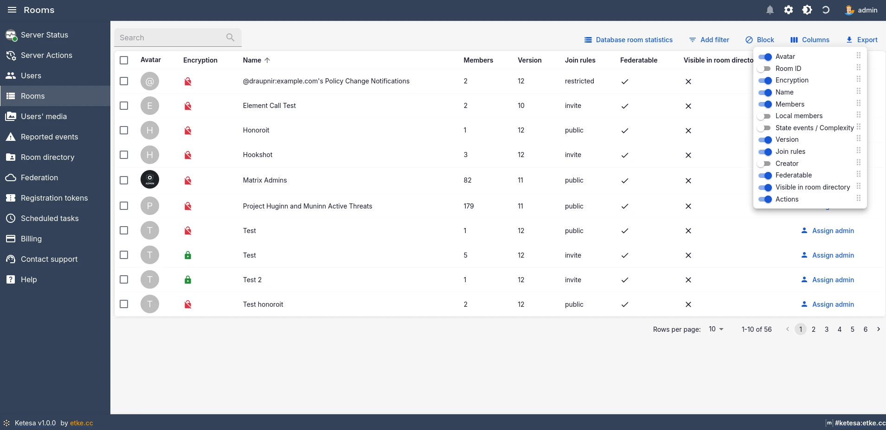
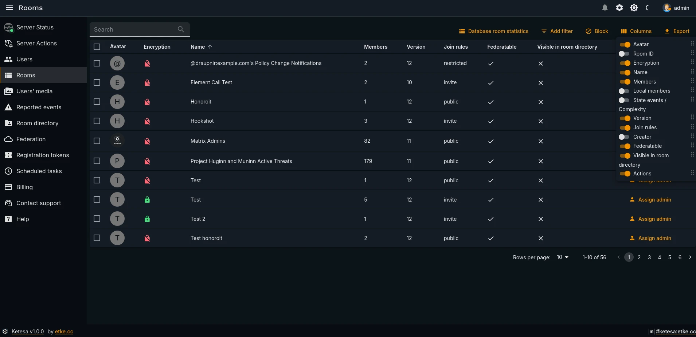

# 🗂️ Configurable Table Columns

| Light | Dark |
|-------|------|
|  |  |

Every data table in Ketesa supports configurable columns — you can show, hide, and reorder columns to match your workflow. Preferences are stored in your browser (localStorage), not on the server, so each browser or device maintains independent settings.

---

## 📋 Supported Tables

The following tables support column configuration:

| Table | Location |
|---|---|
| Users list | **Users** → main list |
| Rooms list | **Rooms** → main list |
| Room directory | **Room Directory** → main list |
| Reports list | **Reports** → main list |
| Registration tokens list | **Registration Tokens** → main list |
| Scheduled tasks list | **Scheduled Tasks** → main list |
| Federation (destinations) list | **Federation** → main list |
| Users' media statistics | **Statistics** → Users' media |
| Database room statistics | **Statistics** → Database rooms |
| Room detail — Members tab | **Rooms** → room detail → Members |
| Room detail — Media tab | **Rooms** → room detail → Media |
| Room detail — State events tab | **Rooms** → room detail → State events |
| Room detail — Forward Extremities tab | **Rooms** → room detail → Forward Extremities |
| Federation destination — Rooms tab | **Federation** → destination detail → Rooms |
| User detail — Devices tab | **Users** → user detail → Devices |
| User detail — Connections tab | **Users** → user detail → Connections |
| User detail — Media tab | **Users** → user detail → Media |
| User detail — Rooms tab | **Users** → user detail → Rooms |
| User detail — Memberships tab | **Users** → user detail → Memberships |
| User detail — Pushers tab | **Users** → user detail → Pushers |
| MAS Upstream OAuth Providers | **MAS** → OAuth Providers |
| MAS Upstream OAuth Links | **MAS** → user detail → Upstream OAuth Links |
| MAS Browser Sessions | **MAS** → user detail → Browser Sessions |
| MAS OAuth2 Sessions | **MAS** → user detail → OAuth2 Sessions |
| MAS Compat Sessions | **MAS** → user detail → Compat Sessions |
| MAS User Emails | **MAS** → user detail → Emails |
| MAS Personal Sessions | **MAS** → user detail → Personal Sessions |

---

## ⚙️ How to Open the Column Configurator

1. Navigate to any supported table (see list above).
2. Look for the **⚙️ settings icon** at the top-right corner of the table toolbar.
3. Click it to open the column picker panel.

> 💡 The icon only appears on desktop-width viewports. On mobile, tables switch to a simplified list layout that does not expose the column configurator.

---

## 👁️ How to Show or Hide a Column

1. Open the column picker panel (see above).
2. Find the column name you want to toggle.
3. Click the **checkbox** next to the column name to show or hide it.
4. The table updates immediately — no save button needed.

---

## 🔀 How to Reorder Columns

1. Open the column picker panel (see above).
2. Locate the **drag handle** (⠿ or similar grip icon) to the left of a column name.
3. Click and drag the row to the desired position in the list.
4. Release to drop — the table column order updates immediately.

---

## 📝 Settings Persistence

> 📝 Column visibility and order settings persist across page reloads and browser sessions as long as you use the same browser profile. Clearing your browser's site data (cookies, localStorage) will reset all column preferences to their defaults.

---

**See also:** [User management](./user-management.md) · [Room management](./room-management.md) · [Documentation index](./README.md)
