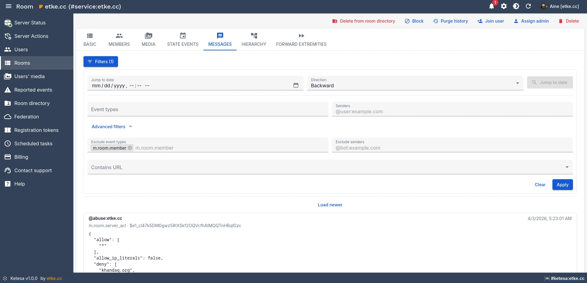
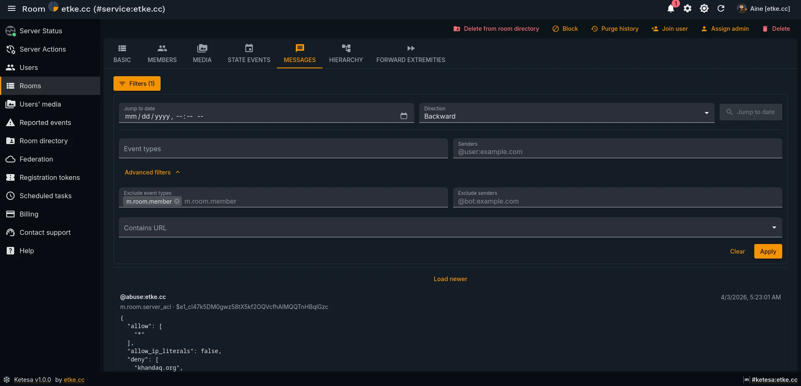
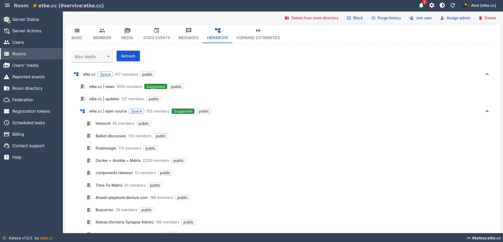
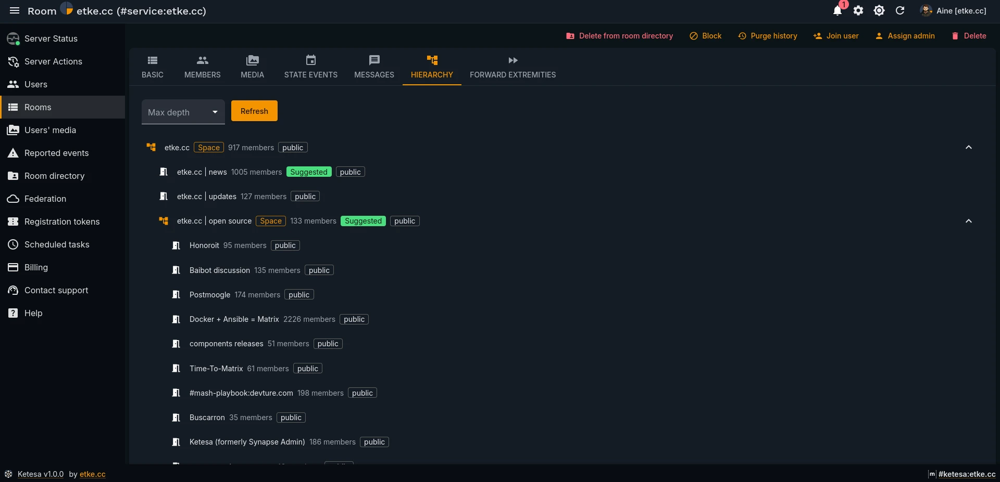

# 🏠 Room Management

Ketesa gives you deep visibility and control over every room on your server. You can inspect content and structure, take moderation actions, manage memberships, and dig into low-level state — all from the Rooms section of the UI.

---

## ✨ Overview

| Capability | Where |
|-----------|-------|
| Block / unblock rooms | List toolbar, bulk action, Show toolbar |
| Publish / unpublish from room directory | Bulk action, Show toolbar |
| Delete rooms | Bulk action, Show toolbar |
| Purge room history | Show toolbar |
| Join a user to a room | Show toolbar |
| Assign a room admin | Show toolbar, Members tab |
| Browse room members | Members tab |
| View raw room state | State tab |
| Inspect forward extremities | Forward Extremities tab |
| Browse and filter room history | Messages tab |
| Navigate Space room trees | Hierarchy tab (Space rooms only) |
| Manage room media | Media tab — see [Media management](./media.md) |

---

## 🔧 Room Actions

All actions are available from the room detail view (**Rooms → click a room → Show**). Some are also available as bulk actions from the rooms list.

---

### 🚫 Block / Unblock

**Block** prevents any user from joining the room. Users already in the room are not affected immediately, but no new joins are allowed. Blocked rooms remain visible to admins.

**Unblock** reverses the block and allows joins again.

> ⚠️ Blocking a room does not remove existing members. Use **Delete room** if you want to remove members and prevent further access entirely.

**How to block a room:**
1. Open the room detail view.
2. Click **Block** in the toolbar. A confirmation dialog shows the room name.
3. Confirm. The toolbar button changes to **Unblock**.

**How to block by room ID (without opening the room):**
1. In the **Rooms** list, click the **Block room by ID** button in the toolbar.
2. Enter the full room ID (e.g. `!abc123:example.com`).
3. Confirm.

**How to bulk-block rooms:**
1. Select one or more rooms in the list using the checkboxes.
2. Click **Block** in the bulk actions bar.

---

### 📋 Publish / Unpublish from Room Directory

Makes a room visible (or invisible) in the public room directory served at `/_matrix/client/v3/publicRooms`.

**How to publish / unpublish:**
1. Open the room detail view.
2. Click **Publish to room directory** or **Unpublish from room directory** in the toolbar.

**Bulk:**
1. Select rooms in the list.
2. Click **Publish to room directory** or **Unpublish from room directory** in the bulk actions bar.

---

### 🗑️ Delete Room

Permanently removes the room. All members are kicked, the room is blocked, and (optionally) local event data is purged.

> ⚠️ This action is irreversible. The dialog asks for confirmation before proceeding.

**How to delete a room:**
1. Open the room detail view.
2. Click **Delete room** in the toolbar.
3. Confirm the deletion in the dialog.

**How to bulk-delete rooms:**
1. Select rooms in the list.
2. Click **Delete room** in the bulk actions bar.

---

### 📜 Purge History

Deletes all events in the room before a specified date. Useful for removing old content to reclaim storage or comply with retention policies.

| Option | Description |
|--------|-------------|
| **Purge events before** | Date/time cutoff — all events before this moment are deleted |
| **Also delete events sent by local users** | When enabled, events from users on your homeserver are also purged (not just remote events) |

> ⚠️ Purged events cannot be recovered. The room itself and its members are not affected — only the event history is removed.

> 📝 Large rooms may take time to purge. The dialog shows a progress indicator and notes that you can safely close the window while the purge runs in the background.

**How to purge room history:**
1. Open the room detail view.
2. Click **Purge history** in the toolbar.
3. Set the **Purge events before** date/time.
4. Optionally enable **Also delete events sent by local users**.
5. Confirm. The dialog shows progress until the purge completes.

---

### 👤 Join User to Room

Joins any Matrix user (from your server or a federated server) to the room as if they had been invited and accepted.

**How to join a user:**
1. Open the room detail view.
2. Click **Join user** in the toolbar.
3. Enter the full MXID of the user (e.g. `@alice:example.com`).
4. Click **Join**.

---

### 👑 Assign Room Admin

Grants a user the highest power level in the room, making them a room administrator.

**How to assign a room admin:**
1. Open the room detail view.
2. Click **Assign admin** in the toolbar (or in the **Members** tab toolbar).
3. Enter the full MXID of the user to promote.
4. Click **Make admin**.

---

## 📑 Room Detail Tabs

Open a room and use the tabs to inspect different aspects of it.

---

### 👥 Members Tab

Shows all users currently in the room with their account status.

| Column | Description |
|--------|-------------|
| Avatar | User avatar |
| User ID | Matrix ID |
| Display name | Current display name |
| Is guest | Whether the account is a guest account |
| Deactivated | Whether the account has been deactivated |
| Locked | Whether the account is locked (MAS) |
| Erased | Whether the account has been erased |

> 💡 Click any user row to navigate to their full user detail page. The **Assign admin** button above the list promotes a user to room admin.

---

### 📊 State Tab

Shows the current raw state events of the room — the collection of events that define the room's settings, membership, permissions, and other configuration.

| Column | Description |
|--------|-------------|
| Type | Matrix event type (e.g. `m.room.power_levels`, `m.room.join_rules`) |
| Origin server timestamp | When the state event was set |
| Content | Raw JSON content of the state event |
| Sender | The user who set this state |

> 💡 Use the State tab to inspect power levels, join rules, history visibility, and other room settings in their raw form — useful when diagnosing unusual room behaviour.

---

### ⏭️ Forward Extremities Tab

Shows the **forward extremities** of the room's event DAG — the most recent events in the room that have no known successors. Under normal circumstances a room should have one or two forward extremities.

| Column | Description |
|--------|-------------|
| ID | Event ID of the extremity |
| Received timestamp | When the server received this event |
| Depth | Position in the event DAG |
| State group | The state group associated with this extremity |

> ⚠️ A large number of forward extremities (hundreds or thousands) is a sign of DAG fragmentation, which can degrade room performance significantly. In this case, consider using the **Purge history** action to clean up old events, or consult the Synapse documentation on forward extremity issues.

---

### 💬 Messages Tab

The **Messages** tab shows paginated room history with rich filtering and jump-to-date navigation. See the detailed sections below.

---

### 🌳 Hierarchy Tab

Available only on **Space** rooms. Shows the full nested room tree. See the detailed section below.

---

### 🖼️ Media Tab

Shows all media files associated with the room. Supports per-file deletion and bulk quarantine. See [Media management](./media.md) for full details.

---

## 💬 Messages Viewer

| Light | Dark |
|-------|------|
|  |  |

The **Messages** tab shows the paginated event history of a room. Each event card displays:

| Field | Description |
|-------|-------------|
| Sender | The Matrix user ID that sent the event |
| Timestamp | Server-origin timestamp (`origin_server_ts`), formatted in the browser's locale |
| Event type | The Matrix event type (e.g. `m.room.message`) |
| Content preview | The event body, membership change, display name, or room name if available; otherwise the raw JSON content |

Events are loaded 20 at a time. The viewer opens at the most recent end of the timeline.

> 📝 Events without a simple body field are shown as formatted JSON in a monospace block, including the `event_id`.

---

### 🔍 Filters

Click the **Filters** button to expand the filter panel. The active filter count is shown in the button label when any filters are set.

#### Basic filters

| Filter | What it does |
|--------|-------------|
| **Event types** | Show only events whose `type` matches one or more values. Choose from common types or type a custom value and press Enter. |
| **Senders** | Show only events sent by the listed Matrix user IDs. |

Common event types offered by the autocomplete:

`m.room.message`, `m.room.member`, `m.room.name`, `m.room.topic`, `m.room.avatar`, `m.room.power_levels`, `m.room.join_rules`, `m.room.history_visibility`, `m.room.canonical_alias`, `m.room.encryption`, `m.room.redaction`, `m.room.third_party_invite`, `m.room.pinned_events`, `m.sticker`, `m.reaction`

#### Advanced filters

Click **Advanced filters** to expand the secondary filter section.

| Filter | What it does |
|--------|-------------|
| **Exclude event types** | Hide events whose `type` matches any of the listed values. |
| **Exclude senders** | Hide events sent by the listed Matrix user IDs. |
| **Contains URL** | Filter by whether events contain a URL. Options: **Any** (no filter), **With URL only**, **Without URL only**. |

Click **Apply** to reload with the current filters. Click **Clear** to reset all filters.

> 💡 Basic and advanced filters combine — for example, show only `m.room.message` events while excluding a specific bot sender.

---

### 📅 Jump to Date

The **Jump to date** field lets you navigate directly to any point in the room's history.

The **Direction** selector controls which event is used as the anchor:

| Value | Meaning |
|-------|---------|
| **Backward** | Find the closest event at or before the given timestamp |
| **Forward** | Find the closest event at or after the given timestamp |

After jumping, the target event is highlighted and the view centres on it. You can continue paginating in either direction from that point.

> ⚠️ If no event exists near the specified timestamp, the viewer shows a warning and the message list is cleared.

---

### ⏩ Pagination

| Control | What it does |
|---------|-------------|
| **Load newer** | Appends the next 20 newer events |
| **Load older** | Appends the next 20 older events |

---

### 📖 How to browse room history

1. Open **Rooms** in the left navigation and click a room.
2. Select the **Messages** tab.
3. The viewer loads the most recent 20 events automatically.
4. Click **Load older** to go further back, or **Load newer** to move forward.

### 📅 How to jump to a specific date

1. Open the **Messages** tab.
2. Click **Filters** to expand the filter panel.
3. Fill in the **Jump to date** field.
4. Choose a **Direction** — **Backward** to land just before, **Forward** to land just after.
5. Click **Jump to date**.
6. The viewer reloads centred on the nearest matching event, highlighted.

### 🔎 How to filter by event type or sender

1. Open the **Messages** tab and click **Filters**.
2. In **Event types**, select or type the type(s) you want (press Enter for custom values).
3. In **Senders**, type a Matrix user ID and press Enter.
4. To exclude instead of include, expand **Advanced filters** and use **Exclude event types** / **Exclude senders**.
5. Click **Apply**. The **Filters** button shows the count of active filters.
6. Click **Clear** to reset.

---

## 🌳 Room Hierarchy

| Light | Dark |
|-------|------|
|  |  |

The **Hierarchy** tab is available only on **Space** rooms (`room_type: m.space`). It shows the full nested structure as an expandable tree.

> 📝 Regular (non-Space) rooms do not have a Hierarchy tab.

---

### 🗂️ What is shown per room in the tree

| Field | Description |
|-------|-------------|
| Name | Display name; falls back to the raw `room_id` if no name is set |
| Room type chip | **Space** or **Room** — shown when `room_type` is set |
| Member count | Number of joined members; hidden when zero |
| Suggested badge | Green **Suggested** chip when the parent Space has marked this child as suggested |
| Join rule chip | The room's join rule (e.g. `public`, `invite`, `knock`) |

Rooms referenced in the hierarchy but not returned by the API are shown as greyed-out placeholder nodes.

---

### ⚙️ Max Depth

The **Max depth** selector controls how many levels of nesting are fetched.

| Value | Meaning |
|-------|---------|
| **Unlimited** | Full hierarchy, no depth limit (default) |
| 1–10 | Limit to that many levels of nesting |

> 💡 For very large Spaces, a lower max depth (e.g. 2 or 3) speeds up loading and reduces noise.

---

### 🔄 Expand / Collapse and Navigation

- The first two levels expand automatically.
- Click a node with children to toggle it.
- Click a leaf room to navigate to its detail view.
- Click **Refresh** to reload the hierarchy.
- If the hierarchy is paginated, a **Load more** button appears at the bottom.

---

### 🧭 How to explore a Space hierarchy

1. Open **Rooms** and find the Space room.
2. Click it to open the detail view, then select the **Hierarchy** tab.
3. The tree loads with the first two levels expanded.
4. Expand branches as needed. Adjust **Max depth** for deeper or shallower traversal.
5. Click **Refresh** after making server-side changes.
6. Click any leaf room to navigate to its detail view.

---

**See also:** [Media management](./media.md) · [User management](./user-management.md) · [Documentation index](./README.md)
