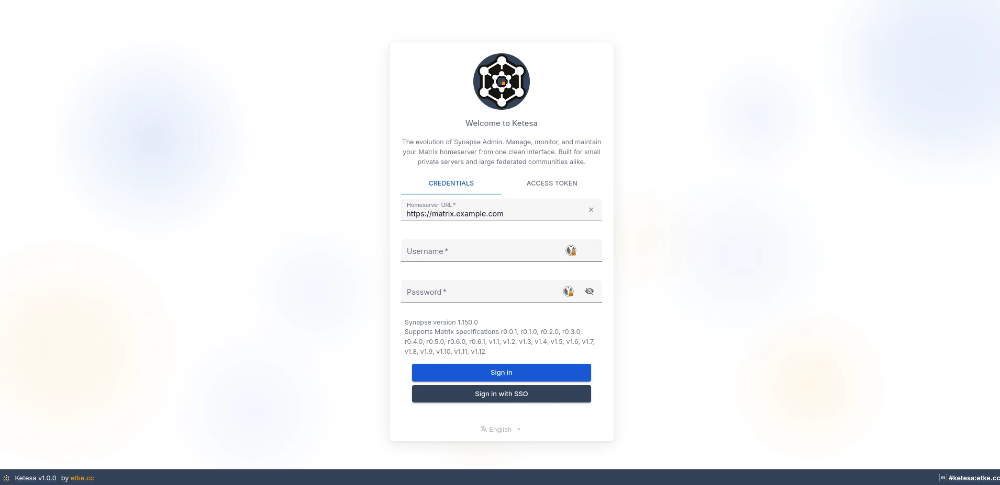
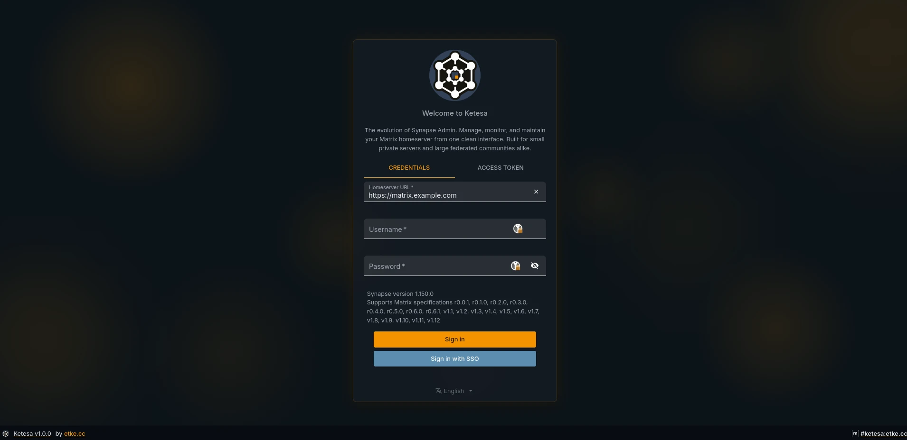
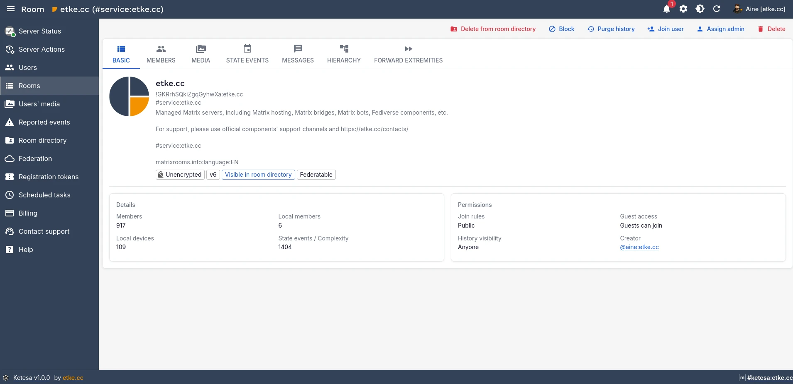
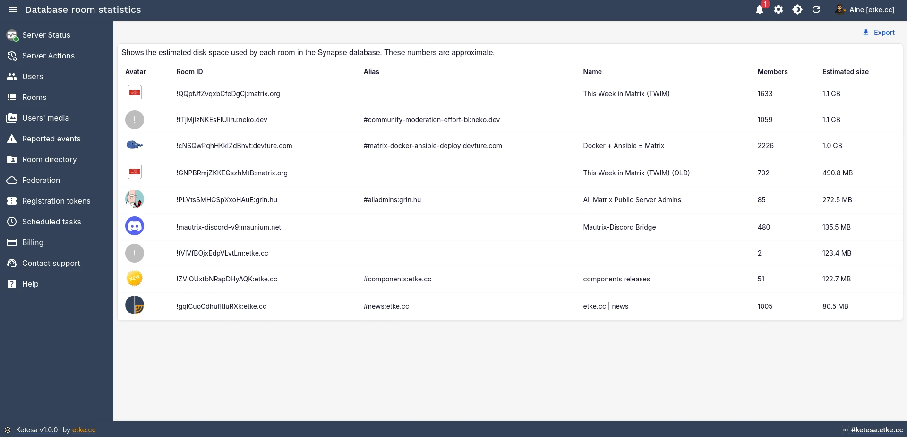
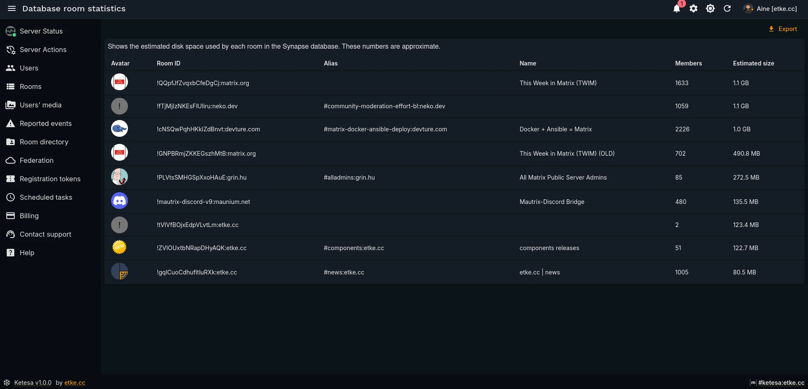
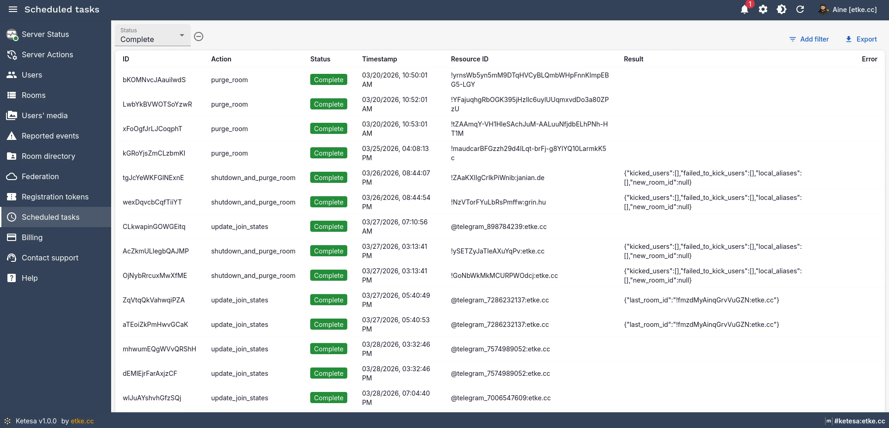
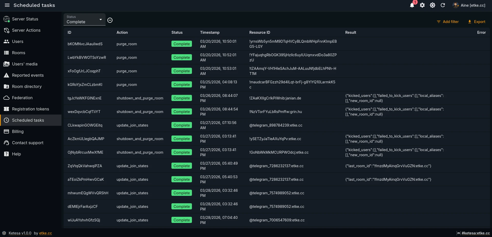
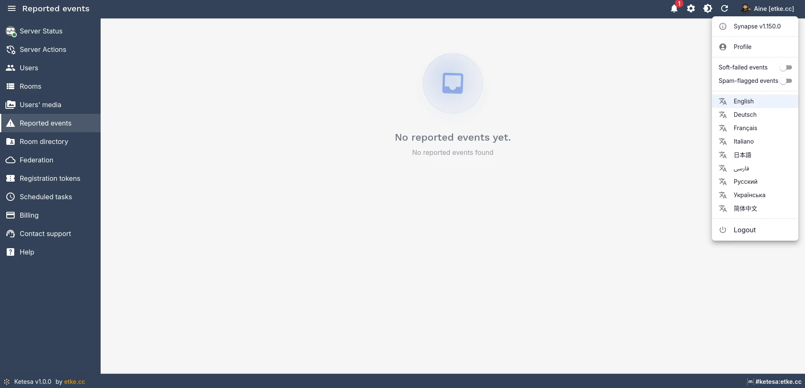
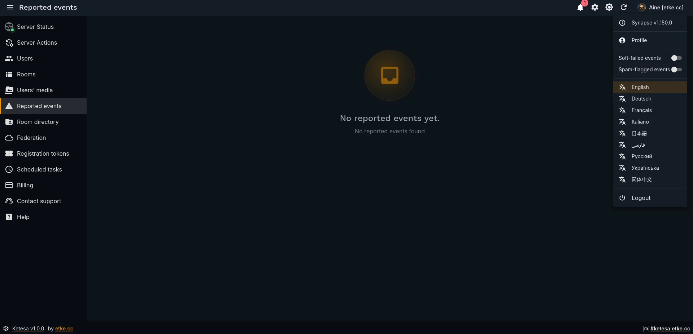

# 📸 Screenshots

Screenshots are organized by theme. Each section shows both light and dark variants where available.

---

## 🔐 Login

| Light                                | Dark                               |
| ------------------------------------ | ---------------------------------- |
|  |  |

---

## 👥 Users List

| Light                                          | Dark                                         |
| ---------------------------------------------- | -------------------------------------------- |
|  |  |

---

## 👤 User Edit

| Light                                         | Dark                                        |
| --------------------------------------------- | ------------------------------------------- |
|  |  |

---

## 💬 Rooms List

| Light                                          | Dark                                         |
| ---------------------------------------------- | -------------------------------------------- |
|  |  |

---

## 🏠 Room View

| Light                                         |
| --------------------------------------------- |
|  |

---

## 💬 Room Messages

| Light                                                      | Dark                                                     |
| ---------------------------------------------------------- | -------------------------------------------------------- |
|  |  |

---

## 🌳 Room Hierarchy

| Light                                                        | Dark                                                       |
| ------------------------------------------------------------ | ---------------------------------------------------------- |
|  |  |

---

## 📊 Room Statistics

| Light                                                | Dark                                               |
| ---------------------------------------------------- | -------------------------------------------------- |
|  |  |

---

## ⏱️ Scheduled Tasks

| Light                                                    | Dark                                                   |
| -------------------------------------------------------- | ------------------------------------------------------ |
|  |  |

---

## 👨‍💼 User Menu

| Light                                        | Dark                                       |
| -------------------------------------------- | ------------------------------------------ |
|  |  |

---

## 🌟 etke.cc Exclusive Features

### 🟢 Server Status

| Light                                                     | Dark                                                    |
| --------------------------------------------------------- | ------------------------------------------------------- |
|  |  |

---

### ⚡ Server Actions

| Light                                                  | Dark                                                 |
| ------------------------------------------------------ | ---------------------------------------------------- |
|  |  |

---

### 🔔 Server Notifications

| Light                                                              | Dark                                                             |
| ------------------------------------------------------------------ | ---------------------------------------------------------------- |
|  |  |

---

### 💳 Billing

| Light                                         | Dark                                        |
| --------------------------------------------- | ------------------------------------------- |
|  |  |

---

### 💬 Support

| Light                                                                  | Dark                                                                 |
| ---------------------------------------------------------------------- | -------------------------------------------------------------------- |
|         |         |
|      |      |
|  |  |
