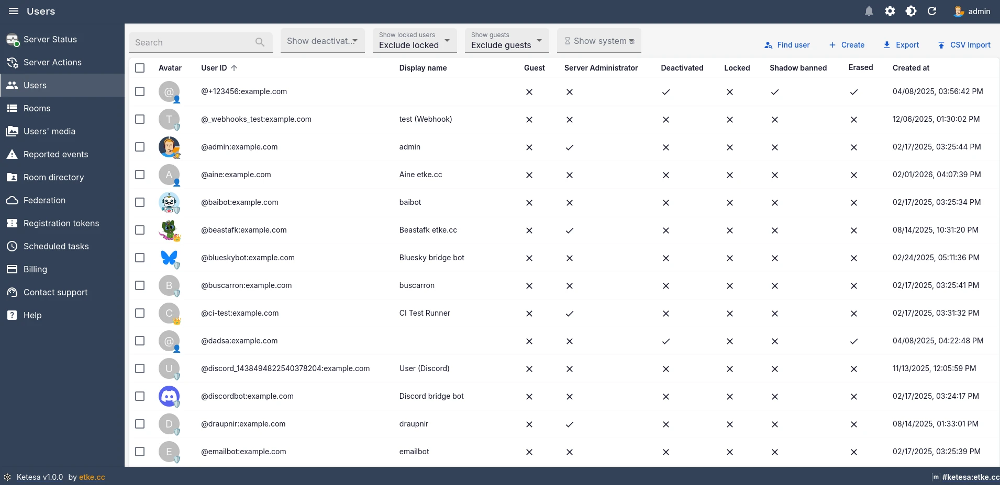
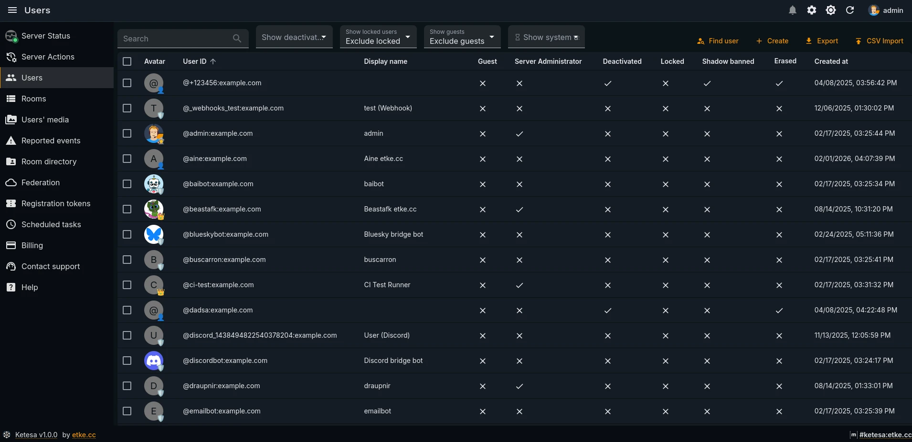
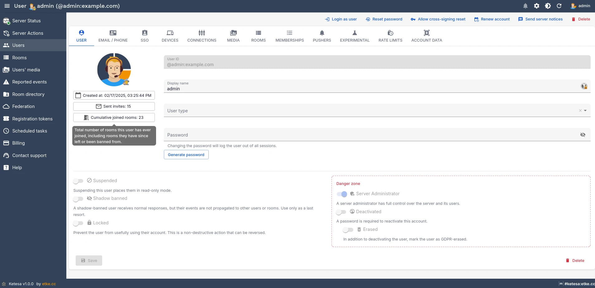
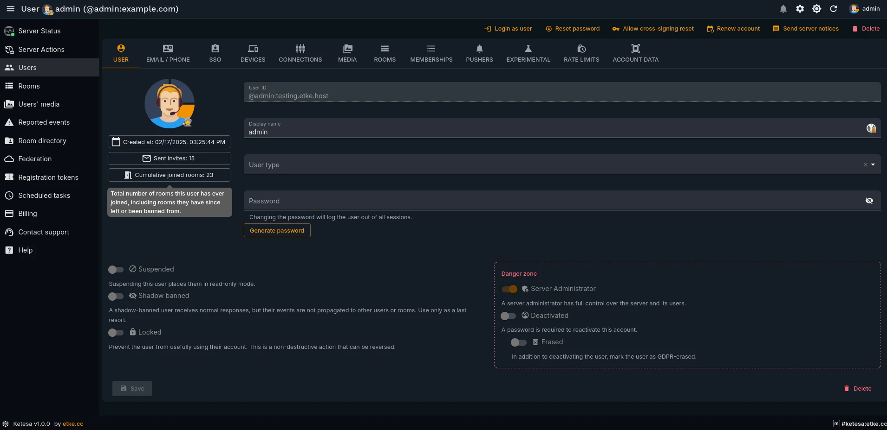

# 👤 User Management

| Light | Dark |
|-------|------|
|  |  |

This guide covers all user management features available in Ketesa, from basic account control to advanced MAS-integrated session and email management.

---

## 📋 Contents

- [Login as user](#-login-as-user)
- [Deactivation vs erasure](#-deactivation-vs-erasure)
- [Shadow ban](#-shadow-ban)
- [Rate limits](#-rate-limits)
- [Experimental features](#-experimental-features)
- [Account data](#-account-data)
- [Server notices](#-server-notices)
- [MAS user management](#-mas-user-management)
- [MAS Policy Data](#-mas-policy-data)
- [Bulk user import](#-bulk-user-import)

---

## 🔑 Login as user

| Light | Dark |
|-------|------|
|  |  |

The **Login as user** button appears in the top toolbar of the user edit page (only when the user is not deactivated and MAS is not configured). Clicking it generates a short-lived access token scoped to that user account, allowing an administrator to act on their behalf — this is commonly called impersonation.

**When to use:**

- Reproducing a bug that only manifests for a specific account.
- Providing hands-on support for a user who cannot access their account.
- Verifying that a permission or room configuration change took effect from the user's perspective.

> ⚠️ The generated token carries the full privileges of the target user. Treat it as a sensitive credential: do not share it, do not store it, and revoke it (log out) as soon as the support task is complete.

> 📝 This feature is only available in native Synapse mode. When `externalAuthProvider` is set and MAS is active, use the MAS password reset or personal-session creation workflow instead.

---

## 🚫 Deactivation vs erasure

Ketesa exposes two levels of account termination. Both are accessible via the **Danger Zone** panel on the user edit page and via the bulk delete button on the user list.

| Action | What it does | Reversible? |
|--------|-------------|-------------|
| **Deactivate** | Disables login, invalidates all access tokens, and kicks the user from all rooms. The account record and message history are preserved. | ✅ Yes — re-enable by unchecking **Deactivated** and setting a new password. |
| **Erase** | Performs deactivation and additionally requests that Synapse purge the user's messages and media from rooms (subject to server configuration). | ❌ No — message and media removal cannot be undone. |

> ⚠️ The **Erased** checkbox only becomes active once **Deactivated** is checked. Unchecking **Erased** on an already-erased account will also uncheck **Deactivated**, effectively reactivating the account record (message content that was already purged is not restored).

> 📝 You cannot deactivate or erase your own admin account. Ketesa prevents this both in the single-user edit view and in bulk actions.

---

## 👁️ Shadow ban

A shadow-banned user's outgoing messages are accepted by the server but never distributed to other users. From the banned user's perspective everything appears normal; other participants simply never receive their messages.

**When to use shadow banning instead of deactivation:**

- Silencing a spam or abuse account without alerting the operator.
- Giving a moderation window to investigate without provoking escalation.

**How to apply:** On the user edit page, enable the **Shadow banned** toggle in the moderation section and save.

**How to remove:** Disable the same toggle and save. The user's subsequent messages will be distributed normally; messages sent while shadow-banned are not retroactively delivered.

> ⚠️ As of Synapse v1.149.1, the user list filter for shadow-banned users does not function correctly — it returns all users rather than only shadow-banned ones. The column in the list view is accurate; the filter is disabled in the UI until upstream support lands.

---

## ⏱️ Rate limits

Ketesa allows per-user rate limit overrides, which take precedence over the server-wide defaults defined in `homeserver.yaml`.

### 📐 Fields

| Field | What it controls |
|-------|-----------------|
| `messages_per_second` | The sustained rate of messages the user may send, expressed as messages per second. |
| `burst_count` | The number of messages the user may send in a burst before the sustained rate limit applies. |

### ✏️ How to override

1. Open the user edit page.
2. Navigate to the **Rate limits** tab (or scroll to the rate limits section).
3. Enter numeric values for `messages_per_second` and/or `burst_count`.
4. Click **Save**.

### 🔄 How to return to server default

Clear both fields (leave them empty) and save. When no per-user override is stored, Synapse falls back to the server-wide rate limit configuration.

> 💡 Rate limit overrides are useful for bot accounts or integration users that legitimately send more messages than a regular user would.

---

## 🧪 Experimental features

Ketesa exposes per-user toggles for Synapse Matrix Spec Change (MSC) experimental features. These are enabled or disabled individually per account and take effect immediately on save — no server restart is required.

| MSC identifier | What it enables |
|---------------|----------------|
| `msc3881` | Remotely toggling push notifications for another client |
| `msc3575` | Experimental sliding sync support |

> 📝 These flags are per-user. Enabling a flag for one account has no effect on other accounts. Server-wide MSC enablement is controlled through `homeserver.yaml` experimental flags, not through Ketesa.

> ⚠️ Experimental features may change or be removed as the Matrix spec evolves. Enable them only when a specific client integration requires it.

---

## 📂 Account data

The **Account data** tab on the user edit page displays a read-only JSON view of the account data stored for that user by Synapse. This is the same data accessible via the Matrix `/account_data` client API endpoint.

Two scopes are shown, each in a collapsible accordion:

| Scope | What it contains |
|-------|-----------------|
| **Global** | Account-wide key-value data not associated with any specific room. Common entries include push rules (`m.push_rules`), identity server preferences, and client-specific settings. |
| **Rooms** | A map of room IDs to per-room account data for that user. Common entries include room tags (`m.tag`), read markers, and room-specific notification overrides. |

**When this is useful:**

- Diagnosing unexpected push notification behaviour by inspecting `m.push_rules`.
- Verifying that a client has correctly stored or migrated user preferences.
- Checking whether a user has applied custom tags or notification settings to specific rooms.

> 📝 Account data is read-only in the Ketesa UI. Editing it directly requires the Synapse Admin API or a Matrix client with the appropriate access token.

---

## 📣 Server notices

Server notices are administrative broadcast messages delivered to users as Matrix messages in a dedicated system room. They appear in the user's client like any other message but originate from the server's notices bot account.

### 📬 Single-user notice

To send a notice to one specific user:

1. Open the user's edit page.
2. Click the **Send server notice** button in the top toolbar.
3. A dialog opens. Enter the notice message body in the text area.
4. Click **Send**.

The notice is delivered to the user's server notices room immediately.

### 📢 Bulk notice

To send the same notice to multiple users at once:

1. Navigate to the **Users** list.
2. Select the target users using the checkboxes in the list.
3. Click the **Send server notice** button in the bulk actions toolbar that appears at the bottom of the page.
4. A dialog opens. Enter the notice message body.
5. Click **Send**.

Ketesa sends the notice to every selected user individually; each user receives a message in their own server notices room.

> ⚠️ Server notices require the `server_notices` feature to be configured in `homeserver.yaml`. If the feature is not configured, the send request will fail with an error.

> 💡 Server notices are a one-way channel — users cannot reply in a way that reaches the admin. For two-way communication, contact the user through a normal Matrix room.

---

## 🔗 MAS user management

> 📝 The following features only appear when `externalAuthProvider` is enabled and [Matrix Authentication Service (MAS)](./external-auth-provider.md) is configured.

When MAS is active, Ketesa integrates with the MAS Admin API to provide account lifecycle management, session control, email management, and upstream OAuth link management directly within the user edit page.

### ➕ Creating users through MAS

When MAS is configured, creating a user is a two-step process:

**Step 1 — MAS create form:** A focused form with three fields:

| Field | Required | Notes |
|---|---|---|
| `username` | Yes | The local part of the MXID (no `@` or homeserver suffix). |
| `password` | No | Optional initial password. Use the generate button for a strong random password. |
| `admin` | No | Grant server administrator status immediately on creation. |

On save, MAS creates the account and Synapse provisions the corresponding user record automatically.

**Step 2 — Full edit page:** After the account is created you are redirected to the standard user edit page, where you can set the displayname, avatar, threepids, and all other profile details.

### 🔐 Setting a password via MAS

The **Set password** button (shown in the top toolbar instead of the standard reset-password button) opens a dialog to set a new password for the user through the MAS API. This is the correct path for password changes when MAS handles authentication.

### 🔄 Account state: deactivate, reactivate, lock, unlock

MAS introduces its own account state model alongside Synapse's:

| State | Behaviour | How to toggle |
|-------|-----------|--------------|
| **Deactivated** | Prevents login via MAS; the account is disabled. Displayed with a timestamp chip showing when deactivation occurred. | Toggle the **Deactivated** checkbox in the Danger Zone panel. |
| **Locked** | Temporarily prevents login without fully deactivating the account. Displayed with a timestamp chip showing when the lock was applied. | Toggle the **Locked** checkbox in the moderation section. |

> 📝 MAS-level deactivation and locking are distinct from Synapse-level deactivation. Synapse deactivation removes the user from rooms and purges tokens; MAS deactivation/locking controls whether the user can authenticate through MAS. Both can be active simultaneously.

### 🖥️ Sessions panel

The **Sessions** tab (only shown in MAS mode) provides a sub-tabbed view of all active and historical sessions for the user. Each session type can be terminated from within the panel.

| Session type | What it represents | How to revoke |
|-------------|-------------------|--------------|
| **Personal sessions** | Long-lived API tokens created by admins or by the user directly (e.g. for bots or automation). Shows scope, human name, active status, and expiry. | Click the revoke button on the session row. |
| **Browser sessions** | Interactive browser-based login sessions tracked by MAS. Shows IP address, user agent, last active time. | Click the finish button on the session row. |
| **OAuth2 sessions** | Sessions established via OAuth 2.0 client applications. Shows client ID, granted scopes (displayed as chips), human name, and last active time. | Click the finish button on the session row. |
| **Compat sessions** | Legacy Matrix compatibility sessions that bridge the old Synapse login flow with MAS. Shows device ID, human name, last active IP. | Click the finish button on the session row. |

Admins can also create new personal sessions directly from the Personal sessions tab by filling in the name, scope, and optional expiry fields and clicking **Create**. The generated access token is shown once in a dialog — copy it before closing, as it cannot be retrieved again.

> ⚠️ Revoking or finishing a session immediately invalidates the associated access token. Any client using that token will be logged out.

### 📧 Emails panel

The **3PIDs / Emails** tab in MAS mode shows all email addresses linked to the user's MAS account.

- **View:** All linked emails are listed with their registration date.
- **Add:** Enter an email address in the field at the bottom of the panel and click **Add**.
- **Remove:** Click the remove button on the email row. The email is unlinked from the MAS account immediately.

> 📝 Email addresses managed here are stored in MAS, not in Synapse's `threepids` table. Changes take effect in MAS and are reflected in the user's authentication options.

### 🔗 Upstream OAuth links panel

The **SSO / Upstream OAuth** tab in MAS mode displays links between the user's MAS account and external OAuth providers (e.g. Google, GitHub, a corporate IdP) that have been configured in MAS.

- **View:** All upstream OAuth links are listed, showing the provider ID, subject identifier, and human account name (if set).
- **Remove:** Click the delete button on the link row.

> ⚠️ Removing an upstream OAuth link means the user can no longer log in using that external provider unless the link is re-created. Ensure the user has an alternative login method (password or another provider) before removing a link.

### 📋 MAS Policy Data

The **Policy Data** page (accessible from the MAS section of the sidebar) allows administrators to view and update the MAS consent policy.

- **Current policy:** Displays the active policy as formatted JSON, with its creation timestamp. If no policy has been set, a "No policy is currently set" message is shown.
- **Set a New Policy:** Enter new policy data as a JSON object in the editor and click **Set Policy**. The editor validates JSON on the fly — the save button is disabled until the input is valid JSON.

> ⚠️ Setting a new policy replaces the existing one immediately. MAS users may be prompted to accept the updated policy terms on their next login.

---

## 📥 Bulk user import

Ketesa supports creating multiple user accounts at once from a CSV file. The import is accessible from the **CSV Import** button in the Users list toolbar. For the full specification of the CSV format, required and optional columns, and error handling behaviour, see [CSV import](./csv-import.md).

---

**See also:** [CSV import](./csv-import.md) · [System users](./system-users.md) · [External auth provider](./external-auth-provider.md) · [User search](./user-search.md) · [Documentation index](./README.md)
