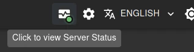
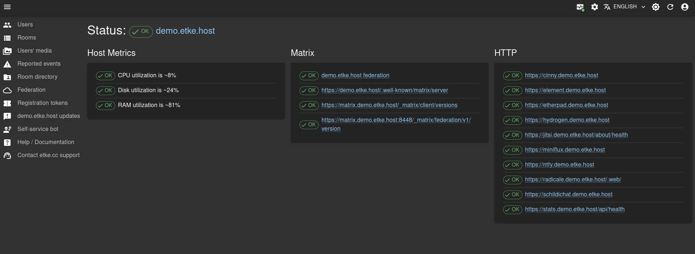
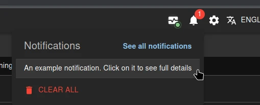
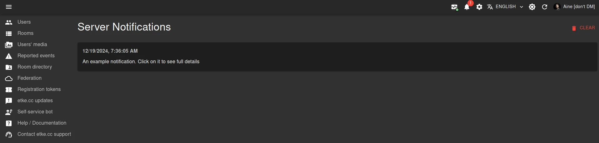
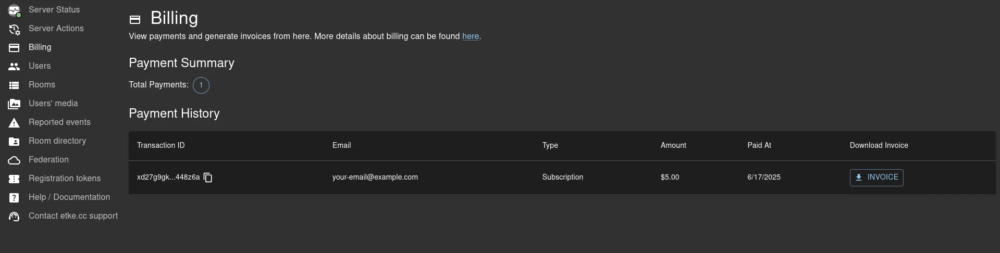

# etke.cc-specific components

This directory contains [etke.cc](https://etke.cc)-specific components that are unusable for any other purpose or configuration.

We at [etke.cc](https://etke.cc) are attempting to develop everything open-source, but some things are too specific to be used by anyone else. This directory contains such components; they are only available for [etke.cc](https://etke.cc) customers.

Due to the specifics mentioned above, these components are documented here rather than in the [docs](../../../docs/README.md). They are not supported as part of the Synapse Admin open-source project (i.e.: no issues, no PRs, no support, no requests, etc.).

## Components

<!-- vim-markdown-toc GFM -->

* [Server Status icon](#server-status-icon)
* [Server Status page](#server-status-page)
* [Server Notifications icon](#server-notifications-icon)
* [Server Notifications page](#server-notifications-page)
* [Server Actions Page](#server-actions-page)
* [Server Commands Panel](#server-commands-panel)
* [Billing Page](#billing-page)
* [Support Page](#support-page)
* [Instance config](#instance-config)

<!-- vim-markdown-toc -->

### Server Status icon

In the application bar, a new monitoring icon is displayed that shows the current server status and uses the following color dot (and tooltip indicators):

* 🟢 (green) - the server is up and running, everything is fine, no issues detected
* 🟡 (yellow) - the server is up and running, but there is a command in progress (likely [maintenance](https://etke.cc/help/extras/scheduler/#maintenance)), so some temporary issues may occur - that's totally fine
* 🔴 (red) - there is at least 1 issue with one of the server's components

The same icon, with a link to the [Server Status page](#server-status-page), is displayed in the sidebar.

### Server Status page

When you click on the [Server Status icon](#server-status-icon) in the application bar, you will be redirected to the
Server Status page. This page contains the following information:

* Overall server status (up/updating/has issues)
* Details about the currently running command (if any)
* Details about the server's components statuses (up/down with error details and suggested actions) by categories

This is [a monitoring report](https://etke.cc/services/monitoring/)

### Server Notifications icon

In the application bar, a new notifications icon is displayed that shows the number of unread (not removed) notifications

### Server Notifications page

When you click a notification in the [Server Notifications icon](#server-notifications-icon)'s list in the application bar, you will be redirected to the Server Notifications page. This page contains the full text of all the notifications you have about your server.

### Server Actions Page

When you click on the `Server Actions` sidebar menu item, you will be redirected to the Server Actions page.
On this page you can do the following:

* [Run a command](#server-commands-panel) on your server immediately
* [Schedule a command](https://etke.cc/help/extras/scheduler/#schedule) to run at a specific date and time
* [Configure a recurring schedule](https://etke.cc/help/extras/scheduler/#recurring) for a command to run at a specific time every week

### Server Commands Panel

When you open the [Server Actions page](#server-status-page), you will see the Server Commands panel.
This panel contains all [the commands](https://etke.cc/help/extras/scheduler/#commands) you can run on your server in one click.
Once a command is finished, you will get a notification about the result.

### Billing Page

When you click on the `Billing` sidebar menu item, you will see the Billing page.
On this page you can see the list of successful payments and invoices.

### Support Page

When you click on the `Contact support` sidebar menu item, you will see the Support page,
where you can see the list of your support tickets, and create a new one if needed.

This is a convenient interface for the existing support system, previously available only via email.
All communication with support is duplicated to email, so you can use both interfaces simultaneously.

### Instance config

With instance config, you can white-label Synapse Admin and disable some features you don't need.

**White-labeling** - the following customizations are available:

* Application name (browser tab title, error pages)
* Logo (login page)
* Favicon (browser tab icon)
* Background image (login page background)

**Disabling features** - the following features can be disabled:

* Server Actions
* Server Status
* Server Notifications
* Billing page
* Support page
* Federation page
* Invite tokens page

Additionally, etke.cc attributions can be removed with the appropriate plan.
