# 🌟 etke.cc-specific components

This is where the etke.cc magic lives. We build everything open-source wherever possible — but some things are purpose-built for the [etke.cc](https://etke.cc) platform and simply wouldn't make sense anywhere else. This directory contains those components: deeply integrated features that turn Ketesa into a full control plane for managed Matrix servers.

> ⚠️ **Heads up:** These components are only available for [etke.cc](https://etke.cc) customers and are documented here rather than in the [main docs](../../../docs/README.md). They are **not supported** as part of the Ketesa open-source project — no issues, no PRs, no support requests.

---

## 🧩 Components

### 🟢 Server Status icon

A live monitoring indicator in the sidebar showing current server health at a glance. It polls your server in the background and updates automatically — no manual refresh needed.

| Color | Meaning |
|-------|---------|
| 🟢 Green | Server is up and running — no issues detected |
| 🟡 Yellow | Server is up, but a command is in progress (likely [maintenance](https://etke.cc/help/extras/scheduler/#maintenance)) — temporary issues may occur, that's expected and fine |
| 🔴 Red | At least one component has an issue — click to see what and why |

---

### 📊 Server Status page

| Light | Dark |
|-------|------|
| 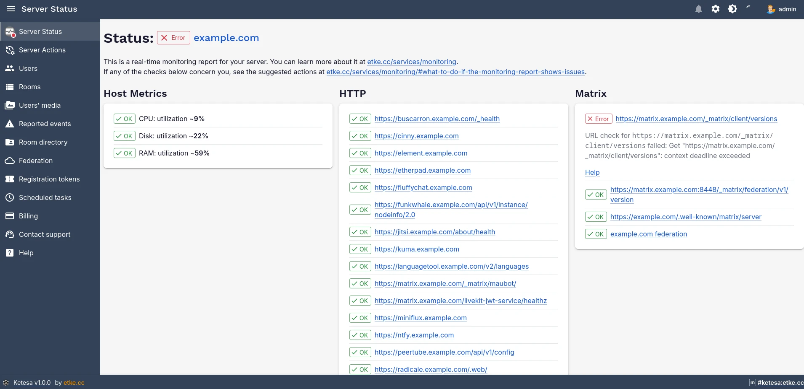 | 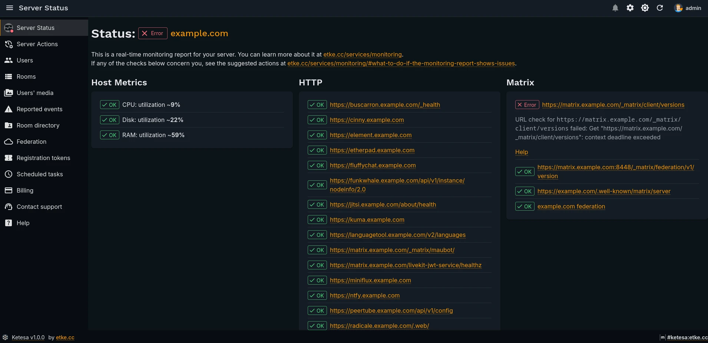 |

Click the [Server Status icon](#-server-status-icon) to open this page. It surfaces the full [monitoring report](https://etke.cc/services/monitoring/) for your server — the same report that etke.cc's monitoring system watches around the clock:

- **Overall server status** — up, updating, or has issues
- **Currently running command** — if maintenance is in progress, you'll see exactly what's happening
- **Per-component breakdown** — every service on your server shown individually with its status, error details, and suggested corrective actions, grouped by category

This is the first place to check when something feels off. If a component is red, the suggested action tells you what to do — often it's a single click in the [Server Actions page](#-server-actions-page).

---

### 🔔 Server Notifications icon

An unread badge in the application bar showing the count of unread server notifications. Notifications are generated by the etke.cc platform for events like:

- Completed or failed server commands
- Service alerts and recoveries
- Important platform announcements
- Scheduled maintenance reminders

The badge clears as you read and dismiss notifications.

---

### 📬 Server Notifications page

| Light | Dark |
|-------|------|
| 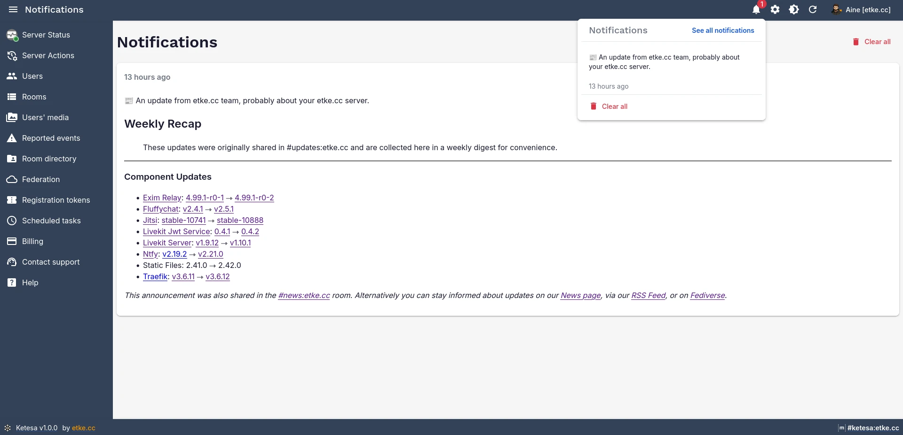 | 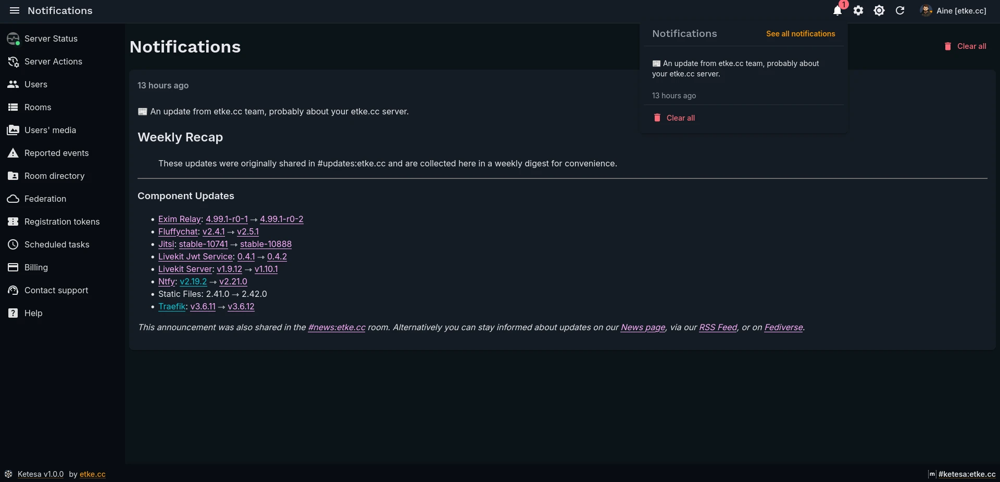 |

Click any notification in the [Server Notifications icon](#-server-notifications-icon)'s dropdown to open this page. It shows the full text of every server notification in one place, with the most recent at the top. You can dismiss individual notifications or clear them all at once.

---

### ⚡ Server Actions page

| Light | Dark |
|-------|------|
| 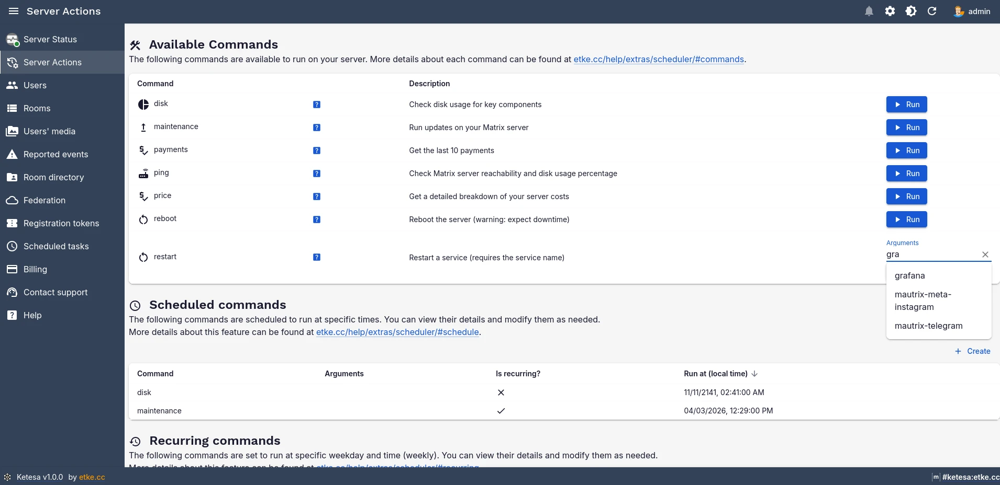 | 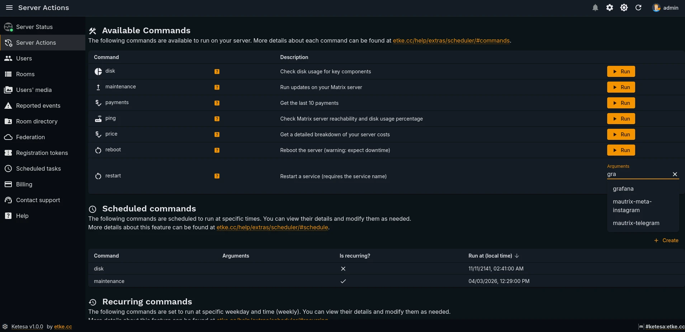 |

Accessible via the **Server Actions** sidebar menu item. This is your command center for server management — everything you'd normally do over SSH or by contacting support, available in one place:

| Action type | What it does |
|-------------|-------------|
| **Run now** | Execute a management command immediately — result arrives as a notification |
| **[Schedule](https://etke.cc/help/extras/scheduler/#schedule)** | Run a command at a specific date and time — useful for planned maintenance windows |
| **[Recurring](https://etke.cc/help/extras/scheduler/#recurring)** | Configure a command to run automatically at a set time every week — for routine tasks like backups or cleanups |

The page includes a full list of [available management commands](https://etke.cc/help/extras/scheduler/#commands) — things like restarting services, running updates, triggering backups, and more. Each command runs with a single click. Some commands accept optional arguments for fine-grained control.

> 💡 Commands that would normally require SSH access or a support ticket are available here directly. No terminal, no waiting.

---

### 🧩 Components page

| Light | Dark |
|-------|------|
| 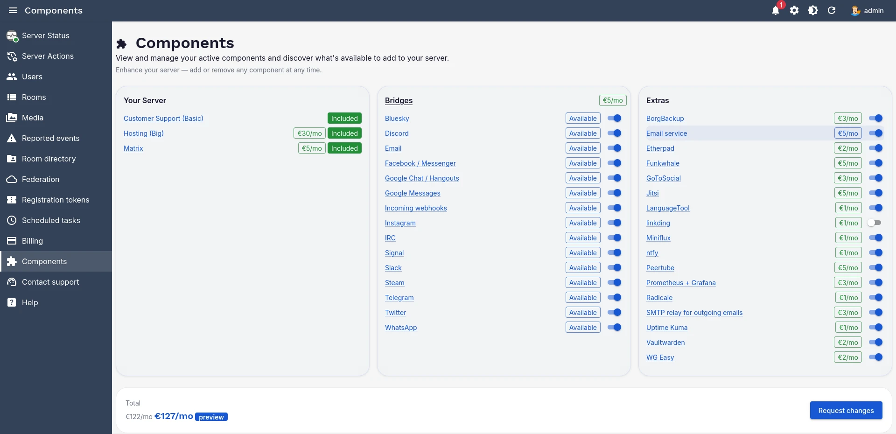 | 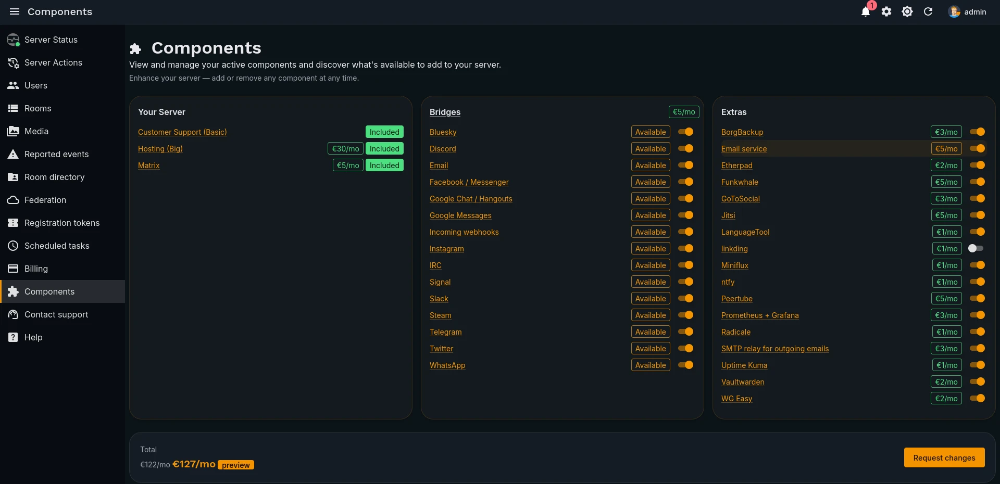 |

Accessible via the **Components** sidebar menu item. A self-service catalogue for your server's add-ons — bridges, bots, apps, and extras:

- **Your Server card** — see every active component and its price at a glance
- **Add-on sections** — browse what's available: Bridges, Extras, Matrix Apps, Matrix Bots, Matrix Extras
- **Live price preview** — stage additions and removals, see the new monthly total before committing
- **One-click requests** — hit **Request changes** to automatically submit a support ticket; no manual back-and-forth needed

Pack-based components (e.g., Bridges) show **Available** when the pack is active — meaning they're included in your pack at no extra charge. Individual add-ons display their monthly price upfront so there are no surprises.

[📄 Full Components guide](../../../docs/components.md)

---

### 💳 Billing page

| Light | Dark |
|-------|------|
| 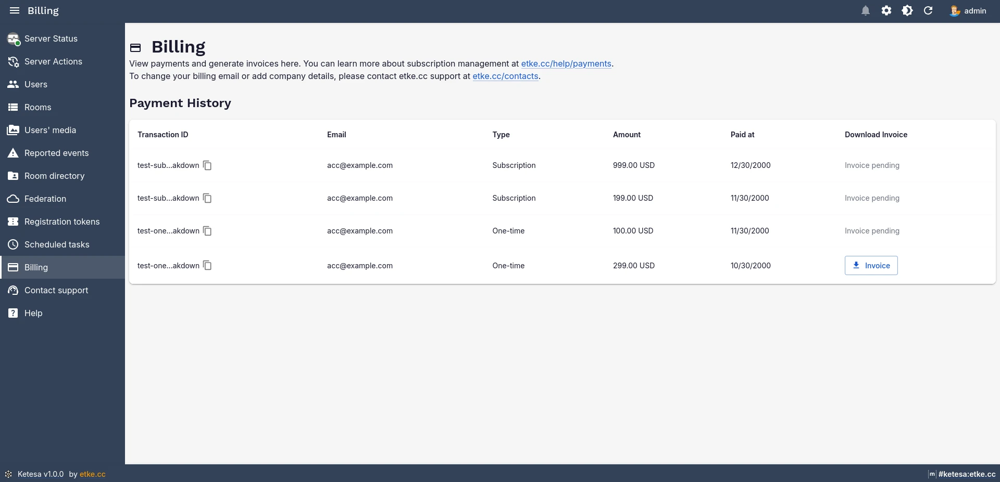 | 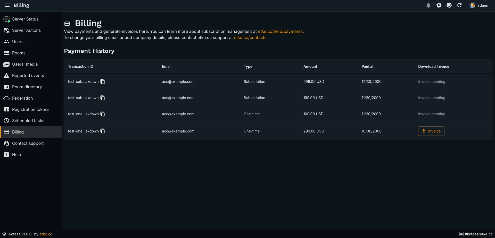 |

Accessible via the **Billing** sidebar menu item. Gives you a full view of your etke.cc account's financial history:

- **Payment history** — all successful transactions with dates and amounts
- **Subscriptions and one-time payments** — both are shown with their details
- **Invoice download** — download a PDF invoice for any transaction directly from this page

No need to log in to a separate billing portal or contact support to get an invoice.

---

### 💬 Support page

| Light | Dark |
|-------|------|
| 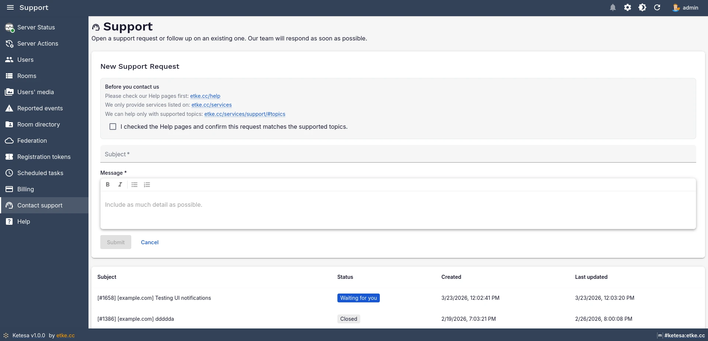 | 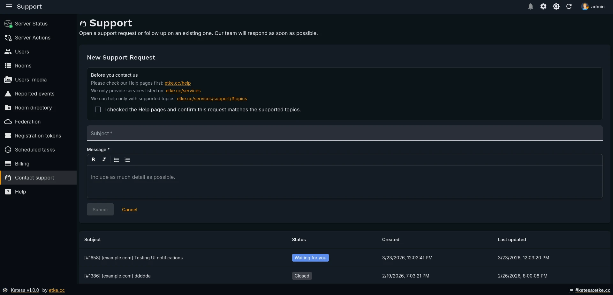 |
| 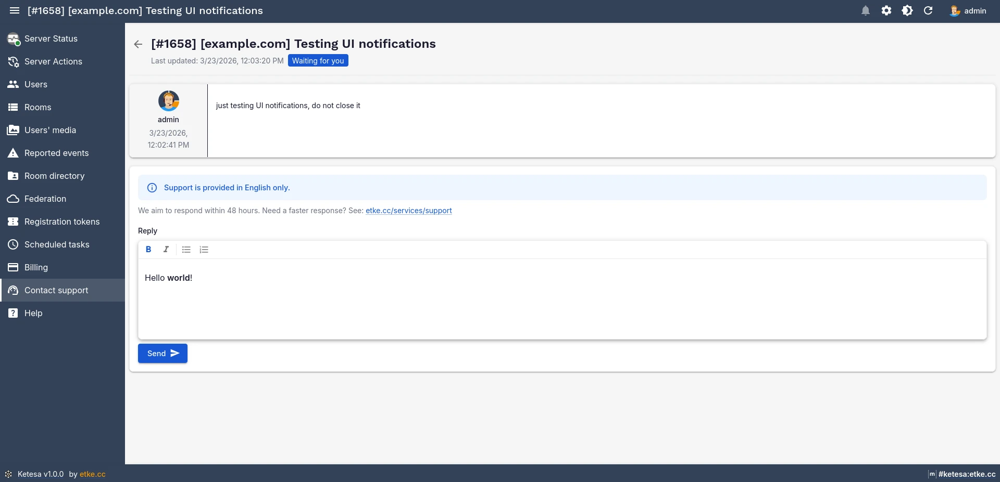 | 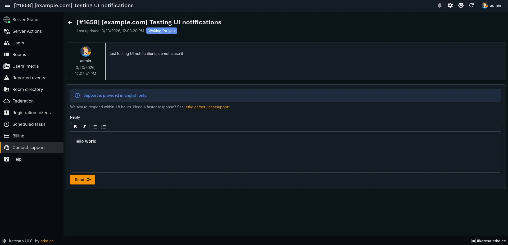 |
| 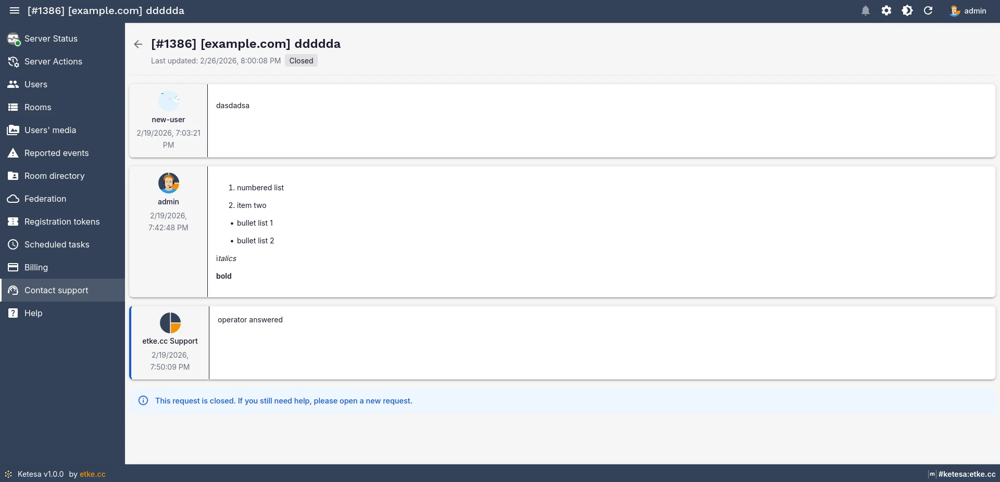 | 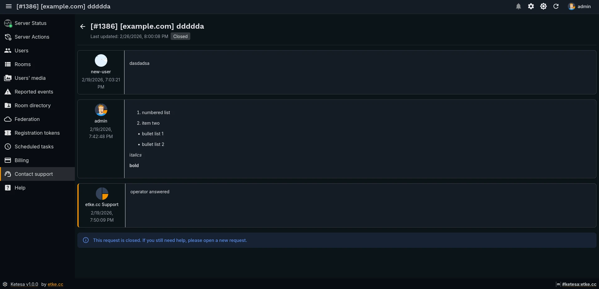 |

Accessible via the **Contact support** sidebar menu item. A full support ticketing interface built directly into Ketesa:

- **View all your tickets** — see open, pending, and resolved requests in one list
- **Create new tickets** — describe your issue and submit without leaving the admin panel
- **Bidirectional messaging** — exchange messages with the etke.cc support team and see their replies inline

> 💡 All communication is mirrored to email — replies arrive in your inbox and you can respond from there too. Both interfaces stay in sync, so you can use whichever is more convenient.

---

### 🎨 Instance config

White-label Ketesa and tailor the feature set for your deployment — all driven by platform configuration, no rebuild or deploy step needed. The configuration is fetched automatically from the etke.cc API when Ketesa loads.

**White-labeling** — make Ketesa look like yours:

| Setting | What it changes |
|---------|----------------|
| Application name | Browser tab title and error page headings |
| Logo | Image shown on the login page |
| Favicon | Browser tab icon |
| Background image | Full-page background on the login screen |

**Disabling features** — hide sections that aren't relevant to your setup:

| Feature | What gets hidden |
|---------|-----------------|
| Server Actions | The Server Actions page and sidebar entry |
| Server Status | The status icon in the sidebar |
| Server Notifications | The notifications badge and page |
| Billing | The Billing page and sidebar entry |
| Support | The Contact support page and sidebar entry |
| Federation | The Federation overview page |
| Invite tokens | The Registration tokens page |

> 📝 etke.cc attributions (footer links and branding) can be removed on the appropriate plan. Contact support if you need this.
