# etke.cc-specific components

These features only light up when Ketesa runs on an [etke.cc](https://etke.cc)-hosted server: they turn the admin panel into the control surface for the managed platform behind it. They talk to etke.cc's hosting backend, so on a self-hosted install they simply do nothing, and they live here instead of the [main docs](../../../docs/README.md) because they are not part of the open-source Ketesa project. No issues, PRs, or support requests for them.

## Components

### Server Status icon

A health indicator in the sidebar. It polls the server in the background and updates on its own, so the color always reflects the current state.

| Color | Meaning |
|-------|---------|
| 🟢 Green | Server is up, nothing wrong |
| 🟡 Yellow | Server is up but a command is running, likely [maintenance](https://etke.cc/help/extras/ketesa/#maintenance); brief disruption is expected and fine |
| 🔴 Red | At least one component has a problem; click through to see what and why |

### Server Status page

| Light | Dark |
|-------|------|
| 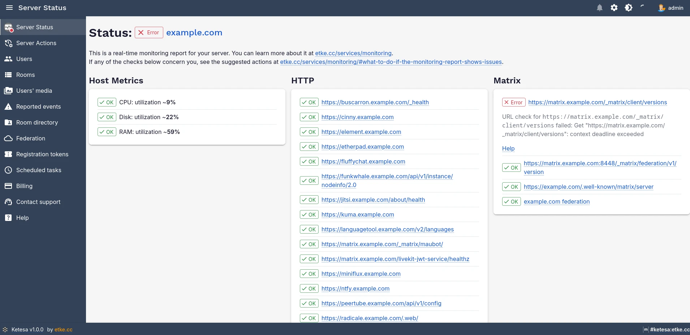 | 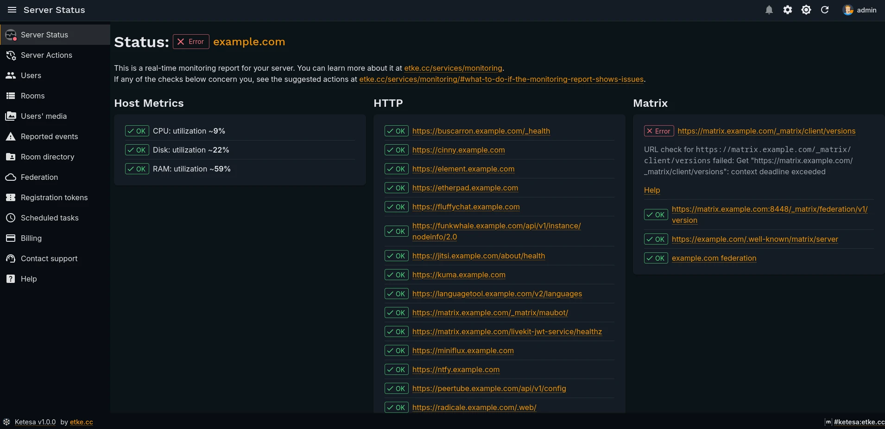 |

Click the [Server Status icon](#server-status-icon) to open it. The page shows the full [monitoring report](https://etke.cc/services/monitoring/), the same one etke.cc's monitoring watches around the clock: the overall status (up, updating, or has issues), the command currently running if maintenance is in progress, and a per-component breakdown with each service's status, error details, and suggested fix, grouped by category.

When something feels off, start here. A red component comes with a suggested action, and often that action is a single click on the [Server Actions page](#server-actions-page).

### Server Notifications icon

An unread-count badge in the app bar. The etke.cc platform raises notifications for completed or failed server commands, service alerts and recoveries, platform announcements, and scheduled-maintenance reminders. The badge clears as you read and dismiss them.

### Server Notifications page

| Light | Dark |
|-------|------|
| 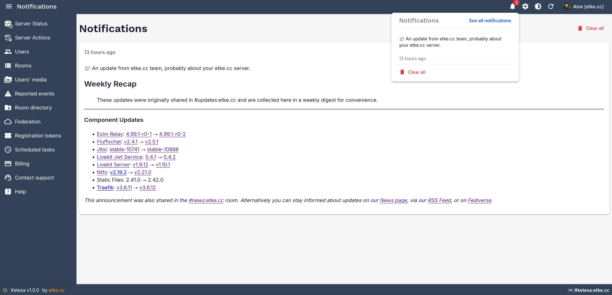 | 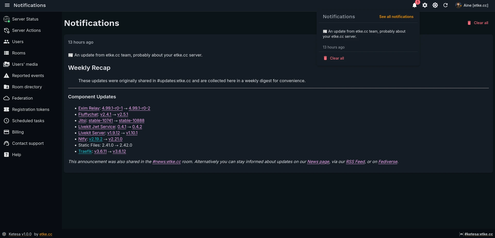 |

Open it from the [Server Notifications icon](#server-notifications-icon) dropdown by clicking any notification. It lists every server notification in full, newest first. Dismiss them one at a time or clear the lot.

### Server Actions page

| Light | Dark |
|-------|------|
| 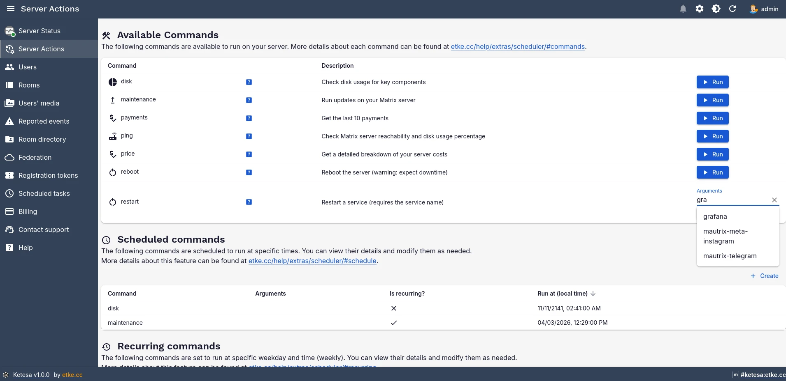 | 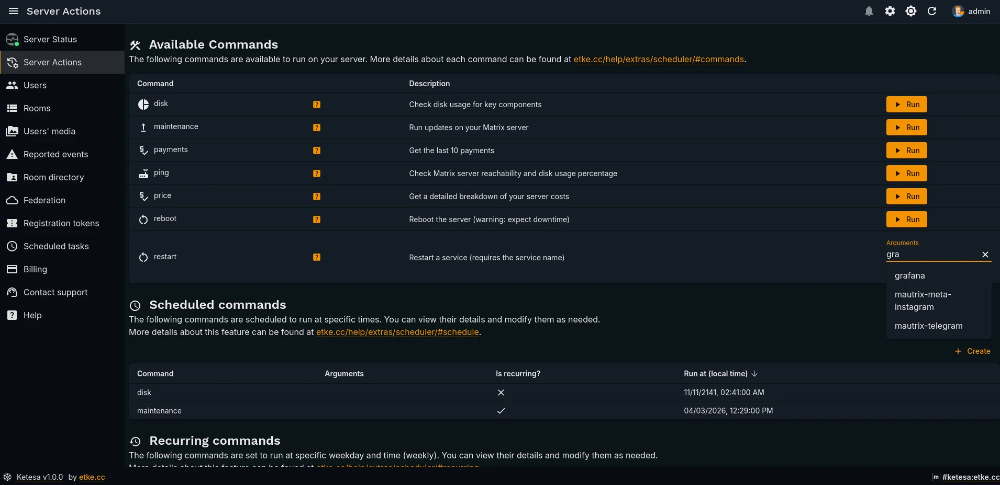 |

Reachable from the **Server Actions** sidebar item. This is the management surface for things you'd otherwise do over SSH or by opening a support ticket:

| Action | What it does |
|--------|--------------|
| **Run now** | Runs a management command immediately; the result comes back as a notification |
| **[Schedule](https://etke.cc/help/extras/ketesa/#schedule)** | Runs a command at a set date and time, for planned maintenance windows |
| **[Recurring](https://etke.cc/help/extras/ketesa/#recurring)** | Runs a command automatically on a weekly schedule, for routine jobs like backups or cleanups |

The [full command list](https://etke.cc/help/extras/ketesa/#commands) covers restarting services, running updates, triggering backups, and more, each a single click; some commands take optional arguments. Anything that would normally need SSH or a support ticket is available here directly.

### Components page

| Light | Dark |
|-------|------|
| 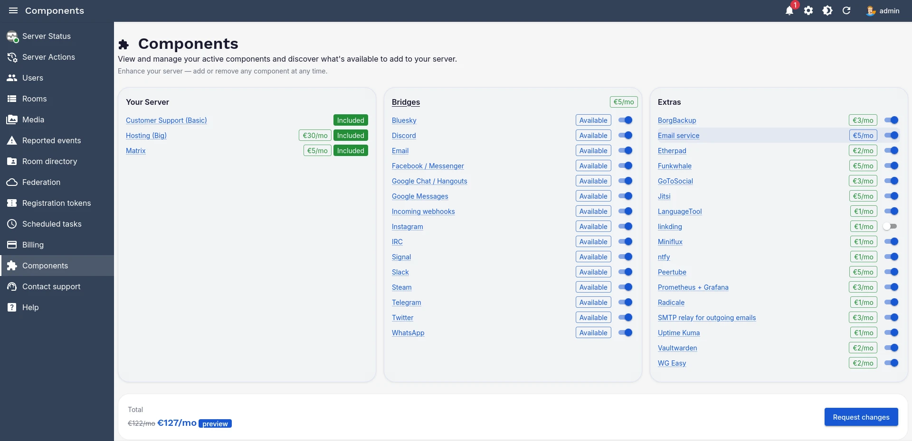 | 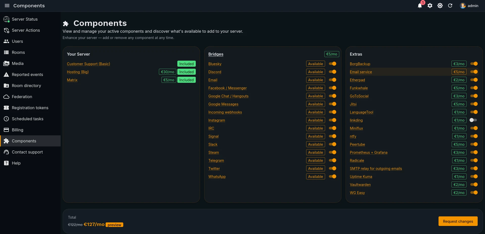 |

Found under the **Components** sidebar item. A self-service catalogue of your server's add-ons: bridges, bots, apps, and extras. The Your Server card lists every active component with its price; the add-on sections (Bridges, Extras, Matrix Apps, Matrix Bots, Matrix Extras) show what's available to add. Staging changes gives you a live price preview, so you see the new monthly total before committing, and **Request changes** files the support ticket for you.

Pack-based components such as Bridges read **Available** when their pack is active, meaning they're included at no extra charge. Individual add-ons show their monthly price upfront.

See the [full Components guide](../../../docs/components.md) for details.

### Billing page

| Light | Dark |
|-------|------|
| 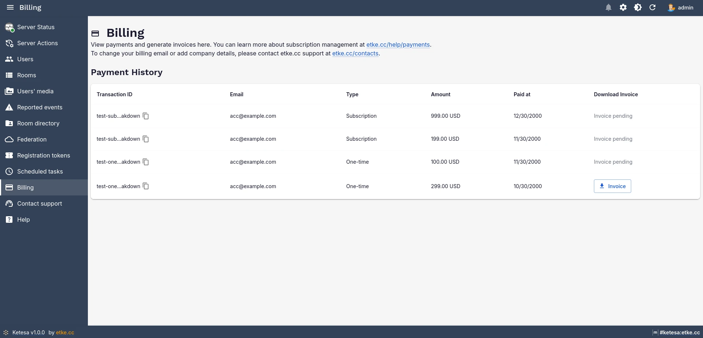 | 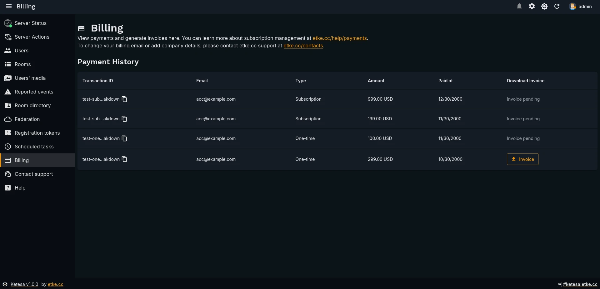 |

Open it from the **Billing** sidebar item. Your etke.cc account's financial history in one place: every successful payment with its date and amount, subscriptions and one-time charges alike, and a PDF invoice you can download for any transaction. No separate billing portal, no support ticket to get an invoice.

### Support page

| Light | Dark |
|-------|------|
| 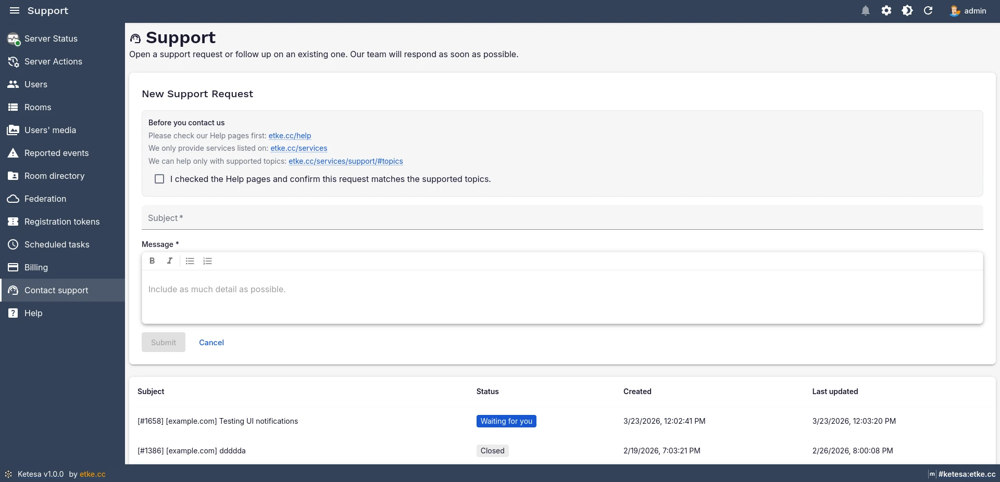 | 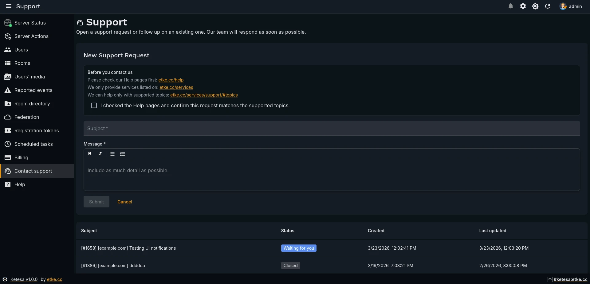 |
| 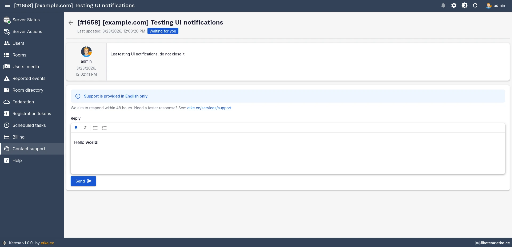 | 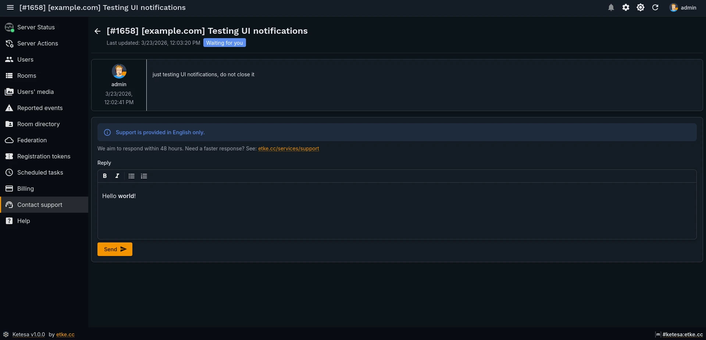 |
| 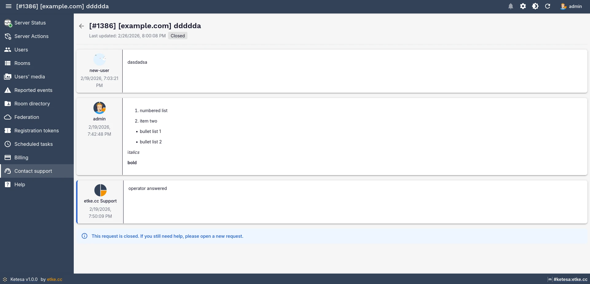 | 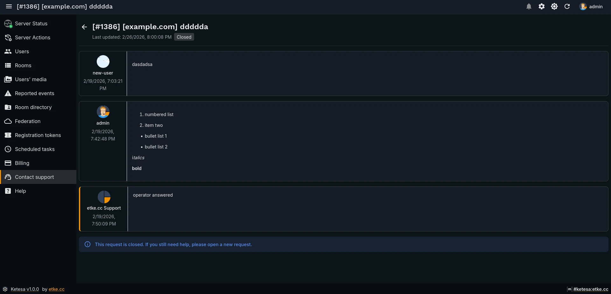 |

The **Contact support** sidebar item opens a full ticketing interface inside Ketesa: see your open, pending, and resolved requests in one list, create a new ticket without leaving the panel, and exchange messages with the etke.cc support team inline. Everything mirrors to email, so replies land in your inbox and you can answer from there; both interfaces stay in sync.

### Instance config

Per deployment, etke.cc's config controls two things about Ketesa, with no rebuild or redeploy (Ketesa pulls the settings from the API as it loads): how it looks, and what it shows.

First, the skin. Swap the name, logo, favicon, and login background so the panel wears your brand instead of Ketesa's:

| Setting | What it changes |
|---------|-----------------|
| Application name | Browser tab title and error-page headings |
| Logo | Image on the login page |
| Favicon | Browser tab icon |
| Background image | Full-page background on the login screen |

Second, what a given deployment even shows. Switch off the pages it has no use for and they leave both the UI and the sidebar:

| Feature | What it hides |
|---------|---------------|
| Server Actions | The Server Actions page and sidebar entry |
| Server Status | The status icon in the sidebar |
| Server Notifications | The notifications badge and page |
| Billing | The Billing page and sidebar entry |
| Support | The Contact support page and sidebar entry |
| Federation | The Federation overview page |
| Invite tokens | The Registration tokens page |

On the right plan, etke.cc's own branding comes off entirely: the footer (links to Ketesa's repo, etke.cc, and the Matrix room) and the "powered by etke.cc" notes and help-page links across the feature pages. Contact support to switch it on.
